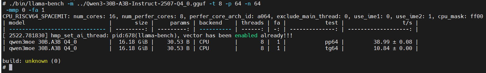

# llama.cpp


**llama.cpp** is an open-source inference framework written in pure C/C++, designed to run large language models such as Llama in GGUF/GGML format efficiently on local CPU/GPU devices, including laptops, phones, Raspberry Pi boards, and even browsers, without depending on heavyweight frameworks. ([https://github.com/ggml-org/llama.cpp](https://github.com/ggml-org/llama.cpp))

## Platform Support

| Platform & System     | Acceleration Support |
|-----------------------|----------------------|
| K1 Buildroot          | ✅ Supported         |
| K1 OpenHarmony 5.0    | ❌ Not supported     |
| K3 Bianbu LXQT/GNOME  | ✅ Supported         |

## Bianbu LXQT/GNOME Usage Guide

### Installation

Open a terminal and run the following command to install `llama.cpp`:

```bash
sudo apt update
sudo apt install llama.cpp-tools-spacemit
```

**Note**: Some older platforms or firmware versions may not provide the `llama.cpp-tools-spacemit` package. In that case, try:

```bash
sudo apt update
sudo apt install llama-server
```

### Download models

Acceleration is currently supported for models in the following five quantization formats:

- Q4_K_M
- Q4_0
- Q4_1
- Q2_K
- Q3_K

Choose a model size appropriate for your chip platform. For K1, `Qwen3-0.6B` is recommended:

```bash
wget https://www.modelscope.cn/models/unsloth/Qwen3-0.6B-GGUF/resolve/master/Qwen3-0.6B-Q4_0.gguf -P ~/
```

For K3, `Qwen3-30B-A3B` is recommended:

```bash
wget https://www.modelscope.cn/models/unsloth/Qwen3-30B-A3B-Instruct-2507-GGUF/resolve/master/Qwen3-30B-A3B-Instruct-2507-Q4_0.gguf -P ~/
```

### Usage

Three common usage methods are available:

- `llama-bench`
- `llama-cli`
- `llama-server`

The following examples use the K3 platform.

#### llama-bench

```bash
llama-bench -m Qwen3-30B-A3B-Instruct-2507-Q4_0.gguf -t 8 -p 64 -n 64 -mmp 0 -fa 1
```

Parameter description:

- `-t`: Number of threads used during the benchmark
- `-p`: Prompt length in tokens
- `-n`: Output generation length
- `-mmp`: Whether to enable multi-modal prompt support
- `-fa`: Whether to enable Flash Attention

Example output:


#### llama-cli

```bash
llama-cli -m Qwen3-30B-A3B-Instruct-2507-Q4_0.gguf -t 8 --no-mmap -c 15360
```

Parameter description:

- `-m`: Path to the `.gguf` model file
- `-t`: Number of threads used during execution
- `--no-mmap`: Disable memory mapping
- `-c`: Context size

Example output:


#### llama-server

Start the background `llama-server` service:

```bash
llama-server -m Qwen3-30B-A3B-Instruct-2507-Q4_0.gguf -t 8 --host 127.0.0.1 --port 8080 --ctx-size 15360 --n-gpu-layers 0 --batch-size 512 --metrics --no-mmap &
```

Parameter description:

- `-m`: Path to the `.gguf` model file
- `-t`: Number of threads used during execution
- `--host`: Server listening IP address
- `--port`: Server listening port, default is 8080
- `--ctx-size`: Model context size in tokens
- `--n-gpu-layers`: Number of model layers offloaded to GPU for faster inference
- `--batch-size`: Number of tokens processed in one batch, affecting throughput and memory usage
- `--metrics`: Enable the Prometheus-format `/metrics` endpoint for monitoring and performance analysis
- `--no-mmap`: Disable memory mapping
- `-c`: Context size

##### Local API request

```bash
curl -X POST http://127.0.0.1:8080/v1/chat/completions \
  -H "Content-Type: application/json" \
  -d '{
        "model": "Qwen3-30B",
        "messages": [
          { "role": "user", "content": "Introduce Zhuhai." }
        ]
      }'
```

Example output:


##### Browser request

Open `http://localhost:8080` in a browser to access the llama server and use `llama.cpp` directly in the browser.


## Buildroot Usage Guide

### Buildroot installation

#### Download

- Download the official SpaceMIT release of `llama.cpp` from the [SpaceMIT llama.cpp archive](https://archive.spacemit.com/spacemit-ai/llama.cpp/) and copy it to the device via `scp` or a similar method.
- Or download it with `wget` as shown below, using version `0.0.5` as an example:

```bash
wget http://archive.spacemit.com/spacemit-ai/llama.cpp/spacemit-llama.cpp.riscv64.0.0.5.tar.gz
```

#### Extract

```bash
tar -zxvf spacemit-llama.cpp.riscv64.0.0.5.tar.gz
```

#### Set `LD_LIBRARY_PATH`

```bash
export LD_LIBRARY_PATH=/root/spacemit-llama.cpp.riscv64.0.0.5/lib/
```

### Buildroot model download

Choose a suitable model size based on your platform. For K1, `Qwen3-0.6B` is recommended:

```bash
wget https://www.modelscope.cn/models/unsloth/Qwen3-0.6B-GGUF/resolve/master/Qwen3-0.6B-Q4_0.gguf -P ~/
```

For K3, `Qwen3-30B-A3B` is recommended:

```bash
wget https://www.modelscope.cn/models/unsloth/Qwen3-30B-A3B-Instruct-2507-GGUF/resolve/master/Qwen3-30B-A3B-Instruct-2507-Q4_0.gguf -P ~/
```

**Note**: If `wget` in Buildroot does not support `https` URLs and reports `wget: not an http or ftp url:`, download the file separately and copy it to the device with `scp` or a similar method.

### Buildroot usage

Three common usage methods are available:

- `llama-bench`
- `llama-cli`
- `llama-server`

The following examples use the K3 platform.

#### Buildroot llama-bench

```bash
cd spacemit-llama.cpp.riscv64.0.0.5
./bin/llama-bench -m ../Qwen3-30B-A3B-Instruct-2507-Q4_0.gguf -t 8 -p 64 -n 64
```

Example output:



#### Buildroot llama-cli

```bash
cd spacemit-llama.cpp.riscv64.0.0.5
./bin/llama-cli -m ../Qwen3-30B-A3B-Instruct-2507-Q4_0.gguf -t 8 --no-mmap -c 15360
```

Example output:


#### Buildroot llama-server

Start the background `llama-server` service:

```bash
./bin/llama-server -m ../Qwen3-30B-A3B-Instruct-2507-Q4_0.gguf -t 8 --host 127.0.0.1 --port 8080 --ctx-size 15360 --n-gpu-layers 0 --batch-size 512 --metrics --no-mmap &
```

##### Buildroot local API request

```bash
curl -X POST http://127.0.0.1:8080/v1/chat/completions \
  -H "Content-Type: application/json" \
  -d '{
        "model": "Qwen3-30B",
        "messages": [
          { "role": "user", "content": "introduce zhuhai？" }
        ]
      }'
```

**Note**: `curl` is not installed in Buildroot by default, so this has not been verified yet.

##### Buildroot browser request

No browser is available in Buildroot, so this has not been verified.

## FAQ

### Does it support VLM models?

Under development. Please stay tuned.

### How can I tell whether AI hardware acceleration is used during inference?

You can use `htop`. If CPU cores 8-15 show high utilization while the model is running, AI hardware acceleration is being used.

### Why is the TPS of `llama-cli` lower than `llama-bench` and `llama-server`?

Because `llama-cli` also handles terminal output and other runtime tasks in addition to model inference. In real projects, `llama-server` is the main reference, so use `llama-server` performance as the baseline.

### How many threads should `llama-server` usually use?

If performance matters, you can fully use all AI cores, 8 on K3 and 4 on K1. If multiple `llama-server` instances are required, assign an appropriate thread count according to each model's compute requirements.
