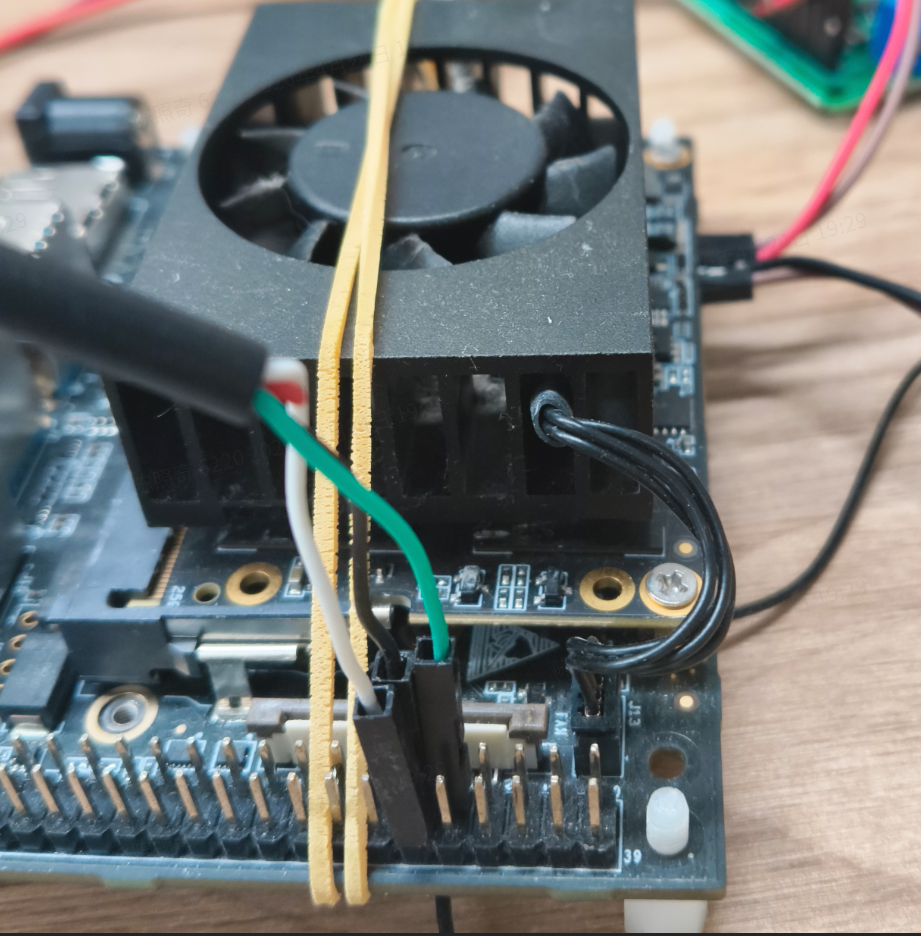
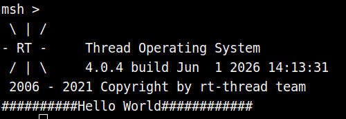
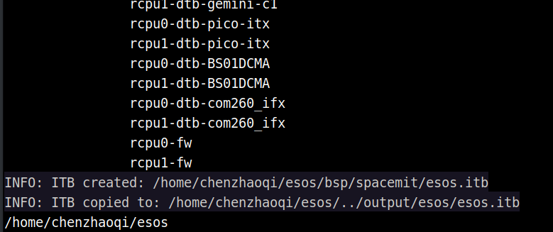
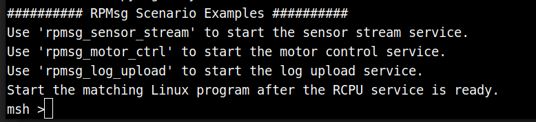

# ESOS Developer Guide

ESOS is a system built on RT-Thread that runs on the RCPU. Its functionality covers two main areas:

1. Working alongside the main core to handle power and performance management, including frequency and voltage scaling, power-switch control, system reboot, and system sleep/wake.
2. Working alongside the main core to handle real-time tasks, such as controlling motor rotation and relay switching.

## Hardware and Software Requirements

- K3 CoM260 development board
- K3 Bianbu 4.0 or later operating system

## ESOS Tag to System Version Mapping

|     Tag      | Bianbu Version |
| :----------: | :------------: |
| k3-br-v1.0.0 |     4.0.0      |
| k3-br-v1.0.2 |     4.0.1      |

The examples in this guide use Bianbu 4.0.0, so the `k3-br-v1.0.0` tag is used. Make sure to match the tag to your system version — a mismatch may prevent the system from booting.

## RCPU Debug Serial Connection



## Build Methods

The ESOS firmware can be built using one of two approaches:

1. **Build directly on the K3 board**: All steps — downloading the source code, installing dependencies, building, and installing the deb package — are performed on the K3 board. This approach requires no cross-compilation toolchain and is well-suited for quick validation and small-scale changes, though build times are slower.
2. **Cross-compile on a PC**: Download the source code on an X86 Ubuntu 22.04 host and build using a cross-compilation toolchain. Then copy the generated `esos.itb`, `rt24_os0_rcpu.elf`, and `rt24_os1_rcpu.elf` to the K3 board to replace the small-core firmware. This approach offers faster build times and is better suited for day-to-day development and frequent debugging.

If you only need to do a quick check of source code changes, building directly on the K3 board is sufficient. For application development, frequent code changes, or integrating a custom project, cross-compilation is recommended.

## Building Directly on the K3 Board

All steps in this section are performed on the K3 development board.

### Downloading the ESOS Source Code

```
cd ~
git clone https://github.com/spacemit-com/esos.git
cd ~/esos
git checkout k3-br-v1.0.0
```

```
cd ~/esos/components
git clone https://github.com/spacemit-com/esos-lite.git
cd ~/esos/components/esos-lite
git checkout k3-br-v1.0.0
```

### Repository Structure

The ESOS repository is based on the RT-Thread source tree. The top-level layout is as follows:

|    Directory / File    | Description                                                                                                                                                         |
| :--------------------: | :------------------------------------------------------------------------------------------------------------------------------------------------------------------ |
|          bsp           | Board support package directory. Contains porting code, boot configuration, peripheral driver adaptations, and project configurations for various chips and boards.  |
|       components       | RT-Thread components directory. Contains upper-layer modules such as file systems, driver frameworks, FinSH, network stacks, C/C++ support, and lightweight components. |
|        include         | RT-Thread kernel and public interface header files. Provides API declarations for kernel objects, the device framework, and system services.                         |
|         libcpu         | CPU architecture porting code. Contains low-level implementations for context switching, interrupts, and startup across ARM, RISC-V, MIPS, and x86 architectures.   |
|          src           | RT-Thread kernel source code. Contains core implementations for thread scheduling, IPC, timers, memory management, and object management.                           |
|         tools          | Build and utility scripts, primarily for SCons builds, project generation, configuration processing, and development helpers.                                        |
|     documentation      | Project documentation, including coding standards, roadmap, Doxygen configuration, and related reference documents.                                                 |
|        examples        | Example code demonstrating usage of RT-Thread kernel features, components, and platform capabilities.                                                               |
|         debian         | Debian packaging directory, including package control files, install scripts, changelog, and packaging rules.                                                       |
|        .github         | GitHub platform configuration, typically including CI workflows, issue templates, and pull request templates.                                                       |
|         .gitee         | Gitee platform configuration directory.                                                                                                                             |
|       README.md        | English project readme covering RT-Thread architecture, features, directory structure, and resources.                                                               |
|      README_zh.md      | Chinese project readme covering RT-Thread architecture, features, directory structure, and development resources.                                                   |
|        Kconfig         | Top-level Kconfig entry point for enabling and disabling kernel features and trimming the system image.                                                             |
|        build.sh        | Project build script.                                                                                                                                               |
|      build_top.sh      | Top-level build helper script.                                                                                                                                      |
|      Jenkinsfile       | Jenkins CI pipeline configuration file.                                                                                                                             |
|      ChangeLog.md      | Project changelog.                                                                                                                                                  |
|        LICENSE         | Project license file.                                                                                                                                               |
|        AUTHORS         | Project authors and contributors.                                                                                                                                   |
|    esos_rt24.its       | ITS configuration file for image packaging.                                                                                                                         |
| esos_rt24_sign.its     | ITS configuration file for signed image packaging.                                                                                                                  |
|    null.spacemit       | Spacemit platform placeholder or configuration file.                                                                                                                |

### Building and Installing

```
sudo apt install lzop
```

```
cd ~/esos
sudo apt-get build-dep .
dpkg-buildpackage -uc -us -b
```

A successful build produces output similar to the following:


The generated deb package is placed in the parent directory.

**Install the deb package:**

```
cd ~/esos
dpkg -i ../bianbu-esos_1.0.0_riscv64.deb
```

After installation, reboot the development board.

After rebooting, the RCPU debug serial port will show new output:



The main program producing this output is located at `~/esos/bsp/spacemit/applications/main.c`. You can modify the printed string to verify that the firmware was replaced successfully.

## Cross-Compilation

**An x86 Ubuntu 22.04 host is recommended for cross-compiling the ESOS source code.**

### Downloading the Source Code (on the PC)

```
cd ~
git clone https://github.com/spacemit-com/esos.git
cd ~/esos
git checkout k3-br-v1.0.0
```

```
cd ~/esos/components
git clone https://github.com/spacemit-com/esos-lite.git
cd ~/esos/components/esos-lite
git checkout k3-br-v1.0.0
```

### Building (on the PC)

```
cd ~/esos
```

**Configure the toolchain**

```
./build.sh config
```

Enter `1`, then `0`. The toolchain will be downloaded automatically — ensure your network is available and wait for it to finish.

**Configure the build target**

```
./build_top.sh config
```

Select `1`.

**Run the build**

```
./build_top.sh
```

Build artifacts are placed in the `../output/esos` directory. The files you need are `rt24_os0_rcpu.elf`, `rt24_os1_rcpu.elf`, and `esos.itb`.

Copy these three files to a directory on the K3 board, for example:

```
cd ~/esos/../output/esos
scp esos.itb rt24_os0_rcpu.elf rt24_os1_rcpu.elf root@10.0.91.102:~/firmware/
```

### Replacing the Small-Core Firmware (on the K3 Board)

```
wget https://archive.spacemit.com/ros2/prebuilt/esos_sh/update_esos_from_dir.sh
bash update_esos_from_dir.sh /root/firmware
```

When the script reports completion (see screenshot below), reboot the board.


After rebooting, the RCPU debug serial port will print new output:


This output comes from `~/esos/bsp/spacemit/applications/main.c`. Changing the printed string is a simple way to confirm the firmware was replaced correctly.

## Application Development Overview

- The K3 board has two RCPUs. RCPU0 handles power and performance management alongside the main core — leave it unchanged. Write your custom real-time logic on RCPU1.
- Place your project code under `~/esos/bsp/spacemit/applications` and control what gets compiled by editing `~/esos/bsp/spacemit/applications/SConscript`.

The example below uses a cross-core RPMsg communication sample to walk through configuring and building a custom project. Cross-compilation is used, but the same steps apply when building directly on the board.

### Downloading the Example Code

Run on the PC:

```
cd ~/esos/bsp/spacemit/applications
git clone https://github.com/spacemit-dev/k3-rt-rpmsg-examples.git
```

### Replacing the SConscript

```
cd ~/esos/bsp/spacemit/applications
cp ./k3-rt-rpmsg-examples/SConscript ./SConscript
```

**SConscript walkthrough**

```
Import('RTT_ROOT')
Import('rtconfig')
from building import *

cwd = GetCurrentDir()

# Select the application source files to compile based on the current board configuration.
# os0_rcpu uses the default main.c.
if rtconfig.BOARD == 'os0_rcpu':
 src = [
  'main.c',
 ]
 # Add the applications directory to the include path so example sources can find shared headers.
 CPPPATH = [
  cwd,
 ]
elif rtconfig.BOARD == 'os1_rcpu':
 # os1_rcpu compiles multiple rpmsg examples: sensor stream, motor control, and log upload.
 src = [
  'k3-rt-rpmsg-examples/01_sensor_stream/sensor_stream_rcpu.c',
  'k3-rt-rpmsg-examples/02_motor_control/motor_control_rcpu.c',
  'k3-rt-rpmsg-examples/03_log_upload/log_upload_rcpu.c',
  'k3-rt-rpmsg-examples/main.c',
 ]
 CPPPATH = [
  cwd,
 ]
else:
 # Default: collect all C source files in the current directory.
 src = Glob('*.c')
 CPPPATH = [
  cwd,
 ]

# -ffunction-sections places each function in its own section,
# allowing the linker to strip unused code.
CCFLAGS = ' -c -ffunction-sections'

# Define the Applications build group for collection and linking by the SCons build system.
group = DefineGroup('Applications', src, depend = [''], CPPPATH = CPPPATH, CCFLAGS = CCFLAGS)

Return('group')
```

RCPU0 keeps the default `main.c` — it just needs to compile without errors. RCPU1 is pointed at the custom application. The build system compiles separate binaries for each RCPU, generates the board-specific DTBs, and packages everything into `esos.itb`.

### Running the Cross-Compilation

```
cd ~/esos
./build_top.sh
```

Normal build output looks like this:



Once the build finishes, follow [Replacing the Small-Core Firmware (on the K3 Board)](#replacing-the-small-core-firmware-on-the-k3-board) to flash the new firmware.

After rebooting, the small-core serial port will print:



### Building the Main-Core Communication Program

Run this step on the K3 board:

```
git clone https://github.com/spacemit-dev/k3-rt-rpmsg-examples.git
```

```
cd ~/k3-rt-rpmsg-examples/01_sensor_stream
gcc -Wall -Wextra -O2 -o k3_sensor_stream k3_sensor_stream.c
```

### Running the Examples

The steps below use `rpmsg_sensor_stream` as an example. For other examples, see the README in the `k3-rt-rpmsg-examples` repository.

**Step 1 — On the small-core terminal, start the service by running `rpmsg_sensor_stream`:**


**Step 2 — On the main core, run:**

```
cd ~/k3-rt-rpmsg-examples/01_sensor_stream
sudo ./k3_sensor_stream -n 100 -p 20
```

`-n <count>` — number of samples or log entries to receive (sensor and log examples)
`-p <ms>` — small-core reporting interval in milliseconds (sensor and log examples)

Terminal output:


## Example 1: Performance Test Suite — Build and Usage

This example uses the cross-compilation approach.

### Downloading the Example Code

Run on the PC:

```
cd ~/esos/bsp/spacemit/applications
git clone https://github.com/spacemit-dev/rt-perf-test.git
```

### Replacing the SConscript

```
cd ~/esos/bsp/spacemit/applications
cp ./rt-perf-test/SConscript ./SConscript
```

### Modifying the Configuration File

Open `~/esos/bsp/spacemit/platform/rt24/os1_rcpu/rt24_os1_rcpu_defconfig` and change:

```
CONFIG_RT_TICK_PER_SECOND=100
```

to:

```
CONFIG_RT_TICK_PER_SECOND=1000
```

### Building and Flashing

Follow the build and firmware replacement steps in the [Cross-Compilation](#cross-compilation) section.

After a successful flash, the small-core serial port will print:


### Running the Tests

For example, running `rtlat_perf` produces:


## Additional ESOS Resources

See: <https://www.spacemit.com/community/document/info?lang=zh&nodepath=software/SDK/buildroot/k3_buildroot/esos>
