sidebar_position: 5

# Remote Desktop Access Guide

This guide explains how to remotely access the MUSE Pi Pro development board desktop from an x86 Ubuntu 24.04 or Windows 11 host machine.

The overall process consists of three stages:

1. **Serial Connection**: Establish serial communication via a USB-to-TTL adapter and log in to the board.
2. **Network Configuration**: Connect the board to the local network and obtain an IP address.
3. **Remote Desktop Connection**: Start the WayVNC service on the board and connect using a VNC client.

> **Note**: Choose the appropriate path based on your board's current state:
> - If this is your **first use (uninitialized)**, proceed to the "First Use (Uninitialized)" section.
> - If the board is **already initialized**, proceed to the "Already Initialized" section.

## x86 Ubuntu 24.04

### Serial Connection Setup

Connect the host machine to the MUSE Pi Pro board's GND, TX, and RX pins using a USB-to-TTL adapter, as shown below:


**Step 1:** Identify the serial device:

```
ls /dev/ttyUSB* 2>/dev/null || ls /dev/ttyACM*
```


In this example, the device is `/dev/ttyUSB0`.

**Step 2:** Install `minicom`:

```
sudo apt update
sudo apt install minicom
```

**Step 3:** Connect using `minicom`:

```
sudo minicom -D /dev/ttyUSB0 -b 115200
```

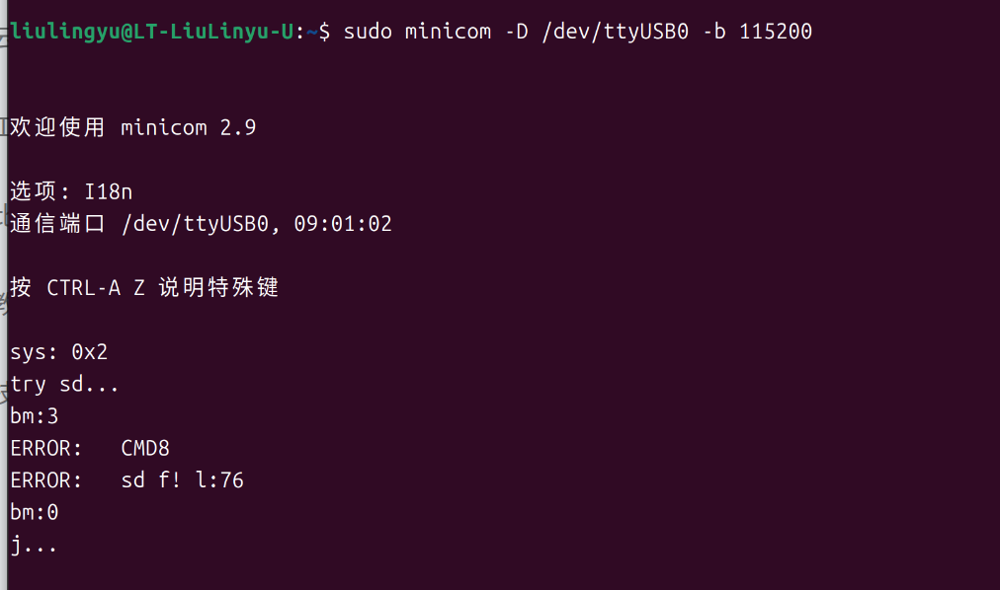

### Ubuntu System Login

**Step 1:** Press the board's reset button and wait for the system to load to the following screen (if the system is already initialized, skip this step).

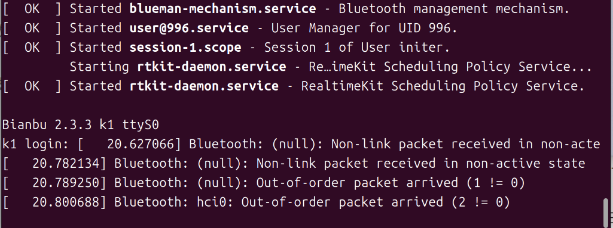

**Step 2:** Press Enter to proceed to the login screen.


**Step 3:** At the prompt, enter the username `root` and press Enter.

**Step 4:** At the password prompt (**Password:**), enter the password `bianbu` (characters will not be displayed) and press Enter.

You will be logged in as the root user on the board.

### First Use (Uninitialized)

#### Stage 1: Network Configuration and IP Address

`<remote_ip>`: The board's local network IP address.

##### Scenario 1: Board Connected via Ethernet

Run the following command:

```
hostname -I
```

The output will display `<remote_ip>`:

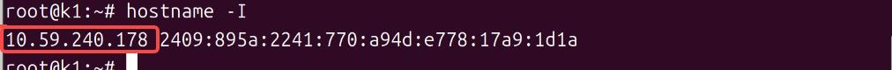

<a id="ubuntu-wifi-scene2"></a>

##### Scenario 2: Board Not Connected via Ethernet (Wi-Fi Setup Required)

**Step 1:** Run the following command:

```
ifconfig
```

Note the network interface name shown in the screenshot (e.g., `wlan0`), as it will be needed for the following commands.

> **Note**: The actual network interface name may not be `wlan0`. Use the name displayed on your system.


**Step 2:** Run the following command:

> **Note**: Replace `wlan0` with your actual network interface name.

```
wpa_cli -i wlan0 add_network
```

**Step 3:** Configure the Wi-Fi SSID and password.

> **Note**: Replace the Wi-Fi name and password in the commands below with your actual credentials.

```
wpa_cli -i wlan0 set_network 0 ssid "\"WiFi_Name\""
wpa_cli -i wlan0 set_network 0 psk "\"WiFi_Password\""
```

**Step 4:** Enable the network configuration:

```
wpa_cli -i wlan0 enable_network 0
```

**Step 5:** Obtain an IP address:

```
/sbin/dhcpcd wlan0
```


**Step 6:** Verify the IP address:

```
hostname -I
```

The output will display `<remote_ip>`:


#### Stage 2: Remote Desktop Connection for Initial Setup

**Step 1:** Write the SDDM configuration file:

```
cat > /etc/sddm.conf <<'EOF'
[Theme]
Current=bianbu-theme
  
[General]
DisplayServer=wayland
GreeterEnvironment=QT_WAYLAND_SHELL_INTEGRATION=xdg-shell,WLR_LIBINPUT_NO_DEVICES=1
  
[Wayland]
CompositorCommand=labwc
SessionDir=/usr/share/calamares/wayland-sessions/
  
[Autologin]
User=initer
Session=bianbu-init
Relogin=false
EOF
```


**Step 2:** Back up the environment configuration script:

```
cp /usr/libexec/start-bianbu-init-env /usr/libexec/start-bianbu-init-env.bak_final
```

**Step 3:** Set the required environment variables:

```
sed -i '/export QT_QPA_PLATFORM=wayland/a\export LABWC_FALLBACK_OUTPUT=NOOP-fallback\nexport LABWC_VIRTUAL_OUTPUT_SIZE=1920x1080' /usr/libexec/start-bianbu-init-env
```

**Step 4:** Get the `labwc` process ID:

```
ps aux | grep labwc | grep -v grep
```

The process ID is shown in the highlighted position in the screenshot below. Use the value displayed on your system.


**Step 5:** Kill the `labwc` process, replacing `<PID>` with the actual process ID:

```
kill <PID>
```


**Step 6:** Restart the SDDM display manager:

```
systemctl restart sddm
```

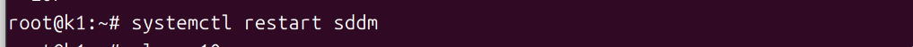

**Step 7:** Wait 5 seconds, then run the following commands in sequence:

```
AUTO_UID=$(id -u initer)
```

```
export XDG_RUNTIME_DIR="/run/user/$AUTO_UID"
```

```
export WAYLAND_DISPLAY=$(basename /run/user/$AUTO_UID/wayland-*)
```

```
export QT_QPA_PLATFORM=wayland
export QT_WAYLAND_SHELL_INTEGRATION=xdg-shell
```


**Step 8:** Start WayVNC:

```
XDG_RUNTIME_DIR="$XDG_RUNTIME_DIR" WAYLAND_DISPLAY="$WAYLAND_DISPLAY" wayvnc 0.0.0.0 5900
```


> **Note**: The host machine and the board must be on the same local network (e.g., connected to the same Wi-Fi network or router) when using any VNC client.

Open a new terminal on the Ubuntu host machine.

The recommended VNC client is **Remmina**. Set it up as follows:

**Step 9:** Install Remmina:

```
sudo apt update
sudo apt install remmina remmina-plugin-rdp remmina-plugin-vnc remmina-plugin-secret
```

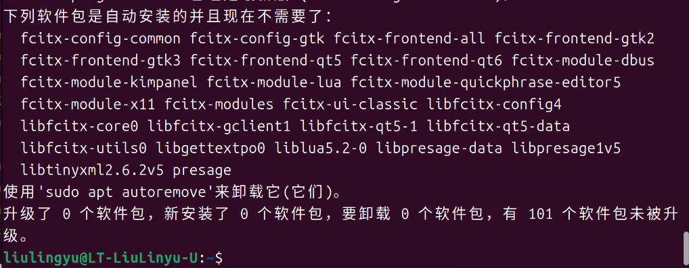

**Step 10:** Launch Remmina:

```
remmina
```


In the connection dialog:

- Set the protocol to **VNC**.
- Enter `<remote_ip>:5900` as the address.
- Press Enter to connect.


The Bianbu system initialization wizard will appear.

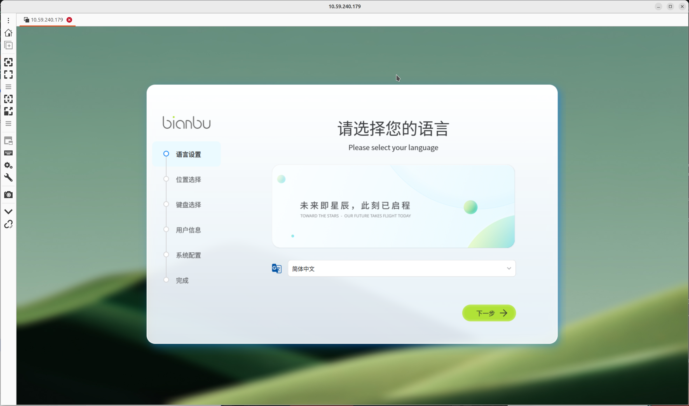

When configuring your user account, keep your credentials in a safe place. It is recommended to set both the username and password to `bianbu` for convenience in subsequent steps. After completing the configuration, the system will proceed with initialization, which takes approximately 10 seconds.

### Already Initialized

#### Stage 1: Network Configuration and User Switch

Log in by following the [**Ubuntu System Login**](#ubuntu-system-login) steps above.

##### Network Configuration

- If Ethernet is connected: proceed to the next step.
- If Ethernet is not connected: the system will be in an offline state. Go to [**First Use (Uninitialized) — Stage 1, Scenario 2**](#ubuntu-wifi-scene2) to complete network setup, then continue.

**Step 1:** Switch to the regular user account. The example below uses `bianbu` — replace it with the username you created during initialization:

```
su - <your_username>
```


#### Stage 2: Remote Desktop Connection

**Step 1:** From your user's home directory, run the following commands:

```
TARGET_USER=$(awk -F: '$3>=1000 && $3<65534 {print $1}' /etc/passwd | head -n1)

sudo tee /etc/sddm.conf > /dev/null <<EOF
[Theme]
Current=bianbu-star

[General]
DisplayServer=wayland
GreeterEnvironment=QT_WAYLAND_SHELL_INTEGRATION=xdg-shell,WLR_LIBINPUT_NO_DEVICES=1
[Wayland]
CompositorCommand=labwc

[Autologin]
User=$TARGET_USER
Session=bianbu-lite
Relogin=false
EOF
```


Enter your user password when prompted.


**Step 2:** Back up the session startup script:

```
sudo cp /usr/bin/startlxqtwayland /usr/bin/startlxqtwayland.clean
```


**Step 3:** Set the required environment variables:

```
sudo sed -i '1a export LABWC_FALLBACK_OUTPUT="NOOP-fallback"\nexport LABWC_VIRTUAL_OUTPUT_SIZE="1920x1080"' /usr/bin/startlxqtwayland
```

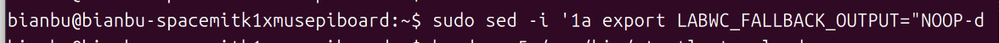

**Step 4:** Restart the SDDM display manager:

```
systemctl restart sddm
```

Enter your password when prompted.

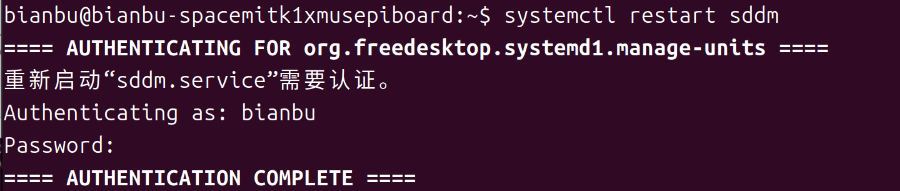

**Step 5:** Wait 5 seconds, then run:

```
WAYLAND_SOCKET=$(find /run/user -path "/run/user/0/*" -prune -o -name "wayland-*" -type s -print 2>/dev/null | head -n1)
XDG_RUNTIME_DIR=$(dirname "$WAYLAND_SOCKET")
WAYLAND_DISPLAY=$(basename "$WAYLAND_SOCKET")
```


**Step 6:** Start WayVNC:

```
XDG_RUNTIME_DIR="$XDG_RUNTIME_DIR" WAYLAND_DISPLAY="$WAYLAND_DISPLAY" wayvnc 0.0.0.0 5900
```

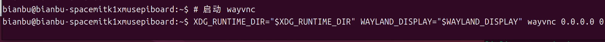

> **Note**: The host machine and the board must be on the same local network (e.g., connected to the same Wi-Fi network or router) when using any VNC client.

Open a new terminal on the Ubuntu host machine.

**Step 7:** Launch Remmina:

```
remmina
```


In the connection dialog:

- Set the protocol to **VNC**.
- Enter `<remote_ip>:5900` as the address.
- Press Enter to connect.

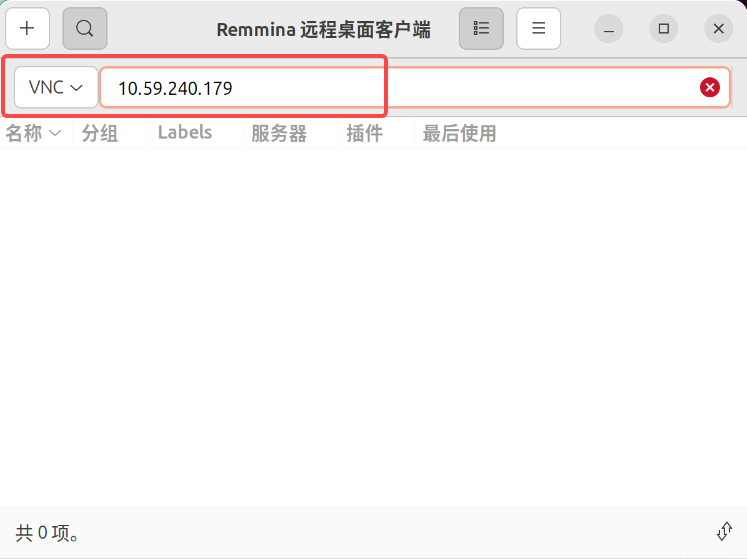

The remote desktop will load and display the board's desktop environment.

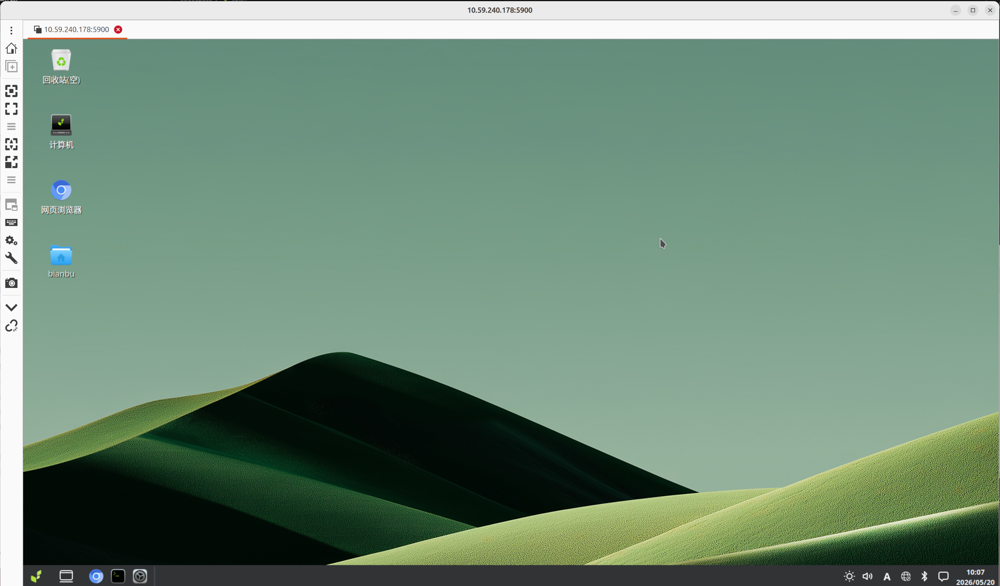

## Windows 11

Download the **MobaXterm** serial terminal tool from the official website:

<https://mobaxterm.mobatek.net/>

Also download either the **RealVNC** or **TigerVNC** client for the VNC connection.

### Serial Connection Setup

Connect the host machine to the MUSE Pi Pro board's GND, TX, and RX pins using a USB-to-TTL adapter, as shown below:


Using MobaXterm:

1. Connect the USB-to-TTL adapter and confirm the COM port is recognized in **Device Manager**:

   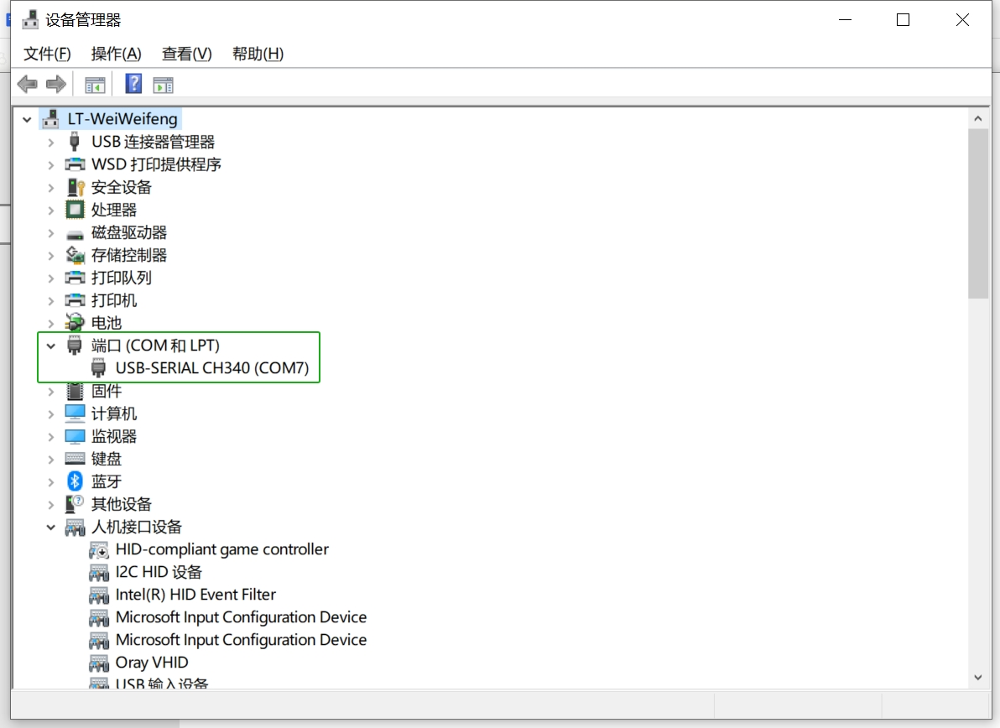

2. Open **MobaXterm**, click **Sessions** → **New Session**, and select **Serial** as the connection type.

3. In the configuration window, set the following:
   - **Serial port**: Select the recognized COM port (e.g., COM7)
   - **Speed**: 115200

   Click **OK** to open the serial terminal.

   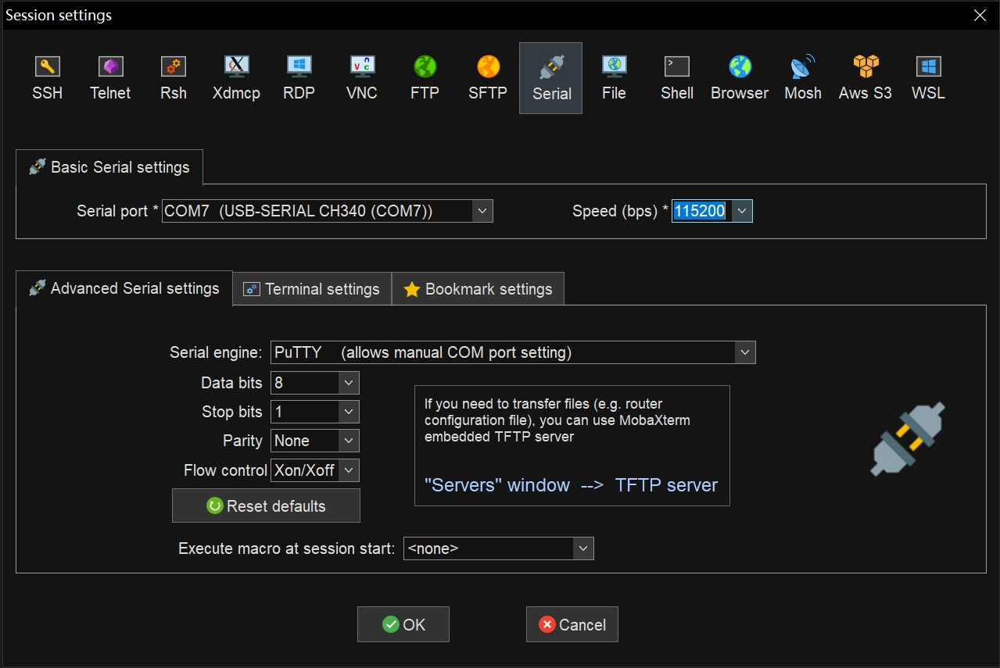

> **Note**: It is normal for MobaXterm to display minor character misalignment or overlap when running commands.

### Windows System Login

**Step 1:** Press the board's reset button and wait for the system to finish loading.

**Step 2:** Press Enter to proceed to the login screen.

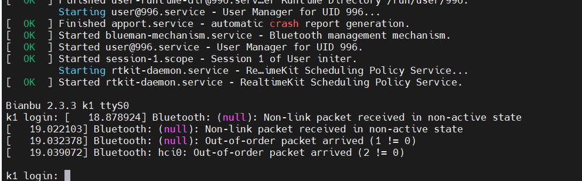

**Step 3:** At the prompt, enter the username `root` and press Enter.

**Step 4:** At the password prompt (**Password:**), enter the password `bianbu` (characters will not be displayed) and press Enter.

You will be logged in as the root user on the board.

### First Use (Uninitialized)

#### Stage 1: Network Configuration and IP Address

`<remote_ip>`: The board's local network IP address.

##### Scenario 1: Board Connected via Ethernet

Run the following command:

```
hostname -I
```

The output will display `<remote_ip>`:

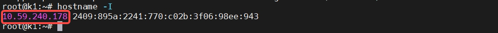

<a id="windows-wifi-scene2"></a>

##### Scenario 2: Board Not Connected via Ethernet (Wi-Fi Setup Required)

**Step 1:** Run the following command:

```
ifconfig
```

Note the network interface name shown in the screenshot (e.g., `wlan0`), as it will be needed for the following commands.

> **Note**: The actual network interface name may not be `wlan0`. Use the name displayed on your system.

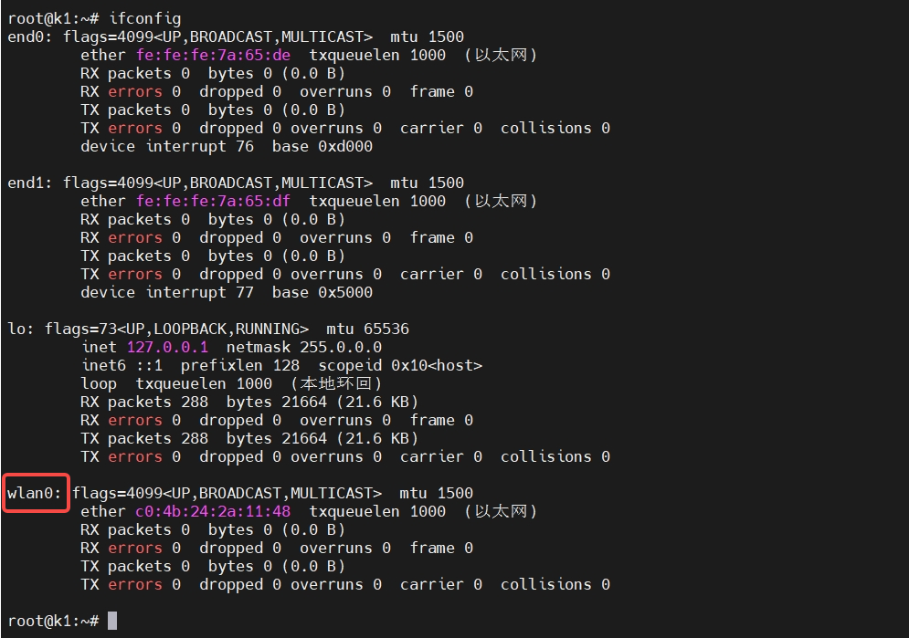

**Step 2:** Run the following command:

> **Note**: Replace `wlan0` with your actual network interface name.

```
wpa_cli -i wlan0 add_network
```


**Step 3:** Configure the Wi-Fi SSID and password.

> **Note**: Replace the Wi-Fi name and password in the commands below with your actual credentials.

```
wpa_cli -i wlan0 set_network 0 ssid "\"WiFi_Name\""
wpa_cli -i wlan0 set_network 0 psk "\"WiFi_Password\""
```


**Step 4:** Enable the network configuration:

```
wpa_cli -i wlan0 enable_network 0
```

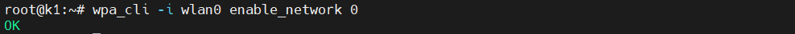

**Step 5:** Wait 5 seconds, then obtain an IP address:

```
/sbin/dhcpcd wlan0
```


**Step 6:** Verify the IP address:

```
hostname -I
```

The output will display `<remote_ip>`:


#### Stage 2: Remote Desktop Connection for Initial Setup

**Step 1:** Write the SDDM configuration file:

```
cat > /etc/sddm.conf <<'EOF'
[Theme]
Current=bianbu-theme

[General]
DisplayServer=wayland
GreeterEnvironment=QT_WAYLAND_SHELL_INTEGRATION=xdg-shell,WLR_LIBINPUT_NO_DEVICES=1

[Wayland]
CompositorCommand=labwc
SessionDir=/usr/share/calamares/wayland-sessions/

[Autologin]
User=initer
Session=bianbu-init
Relogin=false
EOF
```

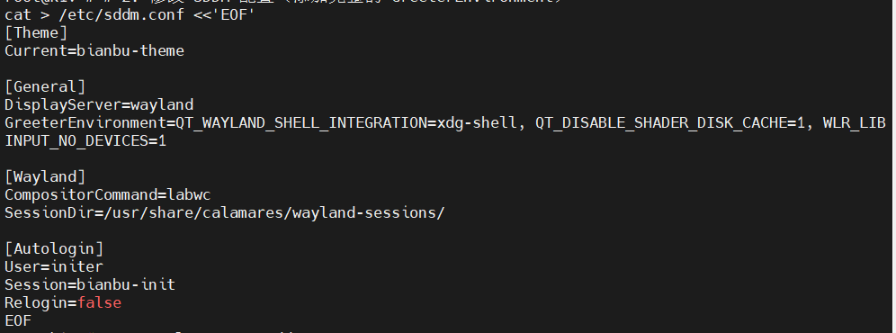

**Step 2:** Back up the environment configuration script:

```
cp /usr/libexec/start-bianbu-init-env /usr/libexec/start-bianbu-init-env.bak_final
```


**Step 3:** Set the required environment variables:

```
sed -i '/export QT_QPA_PLATFORM=wayland/a\export LABWC_FALLBACK_OUTPUT=NOOP-fallback\nexport LABWC_VIRTUAL_OUTPUT_SIZE=1920x1080' /usr/libexec/start-bianbu-init-env
```

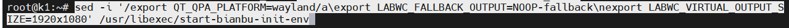

**Step 4:** Get the `labwc` process ID:

```
ps aux | grep labwc | grep -v grep
```

The process ID is shown in the highlighted position in the screenshot below. Use the value displayed on your system.

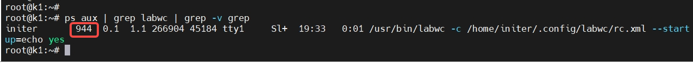

**Step 5:** Kill the `labwc` process, replacing `<PID>` with the actual process ID:

```
kill <PID>
```


**Step 6:** Restart the SDDM display manager:

```
systemctl restart sddm
```


**Step 7:** Wait 5 seconds, then run the following commands in sequence:

```
AUTO_UID=$(id -u initer)
```

```
export XDG_RUNTIME_DIR="/run/user/$AUTO_UID"
```

```
export WAYLAND_DISPLAY=$(basename /run/user/$AUTO_UID/wayland-*)
```

```
export QT_QPA_PLATFORM=wayland
```

```
export QT_WAYLAND_SHELL_INTEGRATION=xdg-shell
```

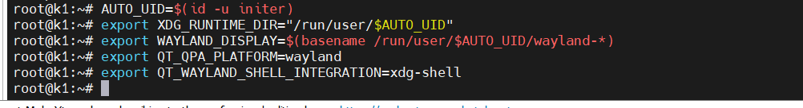

**Step 8:** Start WayVNC:

```
XDG_RUNTIME_DIR="$XDG_RUNTIME_DIR" WAYLAND_DISPLAY="$WAYLAND_DISPLAY" wayvnc 0.0.0.0 5900
```


**Step 9:** Connect using a VNC client:

> **Note**: The host machine and the board must be on the same local network (e.g., connected to the same Wi-Fi network or router) when using any VNC client.

**Option A — RealVNC Viewer:**

1. Launch RealVNC Viewer.
2. Enter `<remote_ip>` (e.g., `192.168.1.100`) in the address bar.
3. Press Enter to connect.

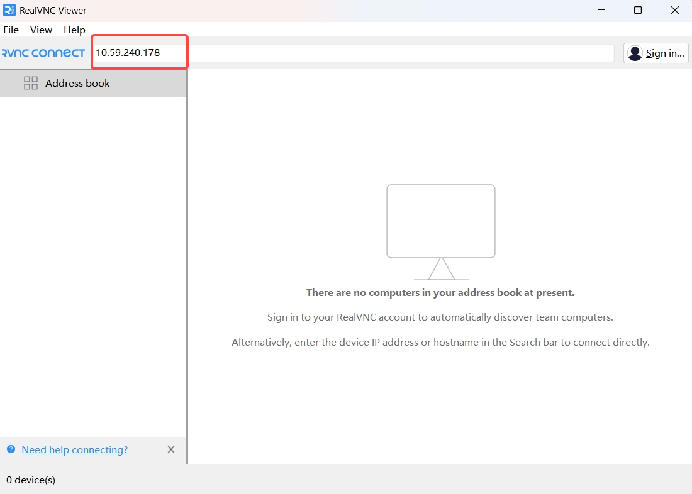

Click the item shown in the highlighted area.


The Bianbu system initialization wizard will appear.

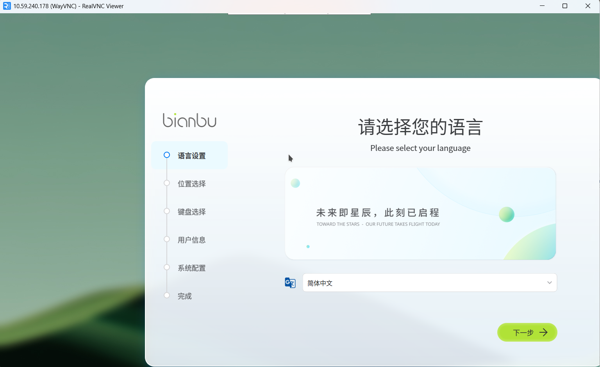

**Option B — TigerVNC:**

1. Launch TigerVNC.
2. Enter the board's IP address (e.g., `10.59.240.178`) in the VNC server address field.
3. Click **Connect**.

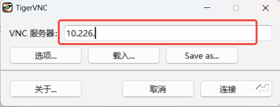

The Bianbu system initialization wizard will appear.


When configuring your user account, keep your credentials in a safe place. It is recommended to set both the username and password to `bianbu` for convenience in subsequent steps. After completing the configuration, the system will proceed with initialization, which takes approximately 10 seconds.

### Already Initialized

#### Stage 1: Network Configuration and User Switch

Log in by following the [**Windows System Login**](#windows-system-login) steps above.

##### Network Configuration

- If Ethernet is connected: proceed to the next step.
- If Ethernet is not connected: the system will be in an offline state. Go to [**First Use (Uninitialized) — Stage 1, Scenario 2**](#windows-wifi-scene2) to complete network setup, then continue.

**Step 1:** Switch to the regular user account. The example below uses `bianbu` — replace it with the username you created during initialization:

```
su - <your_username>
```

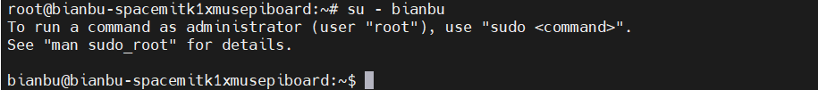

#### Stage 2: Remote Desktop Connection

**Step 1:** From your user's home directory, run the following commands:

```
TARGET_USER=$(awk -F: '$3>=1000 && $3<65534 {print $1}' /etc/passwd | head -n1)

sudo tee /etc/sddm.conf > /dev/null <<EOF
[Theme]
Current=bianbu-star

[General]
DisplayServer=wayland
GreeterEnvironment=QT_WAYLAND_SHELL_INTEGRATION=xdg-shell,WLR_LIBINPUT_NO_DEVICES=1
[Wayland]
CompositorCommand=labwc

[Autologin]
User=$TARGET_USER
Session=bianbu-lite
Relogin=false
EOF
```


Enter your user password when prompted.

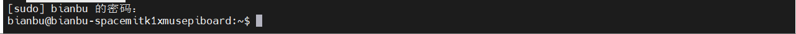

**Step 2:** Back up the session startup script:

```
sudo cp /usr/bin/startlxqtwayland /usr/bin/startlxqtwayland.clean
```


**Step 3:** Set the required environment variables:

```
sudo sed -i '1a export LABWC_FALLBACK_OUTPUT="NOOP-fallback"\nexport LABWC_VIRTUAL_OUTPUT_SIZE="1920x1080"' /usr/bin/startlxqtwayland
```


**Step 4:** Restart the SDDM display manager:

```
systemctl restart sddm
```


Enter your password when prompted.

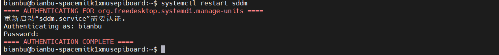

**Step 5:** Run the following commands to locate the Wayland socket:

```
WAYLAND_SOCKET=$(find /run/user -path "/run/user/0/*" -prune -o -name "wayland-*" -type s -print 2>/dev/null | head -n1)
```


**Step 6:** Set the runtime directory:

```
XDG_RUNTIME_DIR=$(dirname "$WAYLAND_SOCKET")
```


**Step 7:** Set the Wayland display:

```
WAYLAND_DISPLAY=$(basename "$WAYLAND_SOCKET")
```


**Step 8:** Start WayVNC:

```
XDG_RUNTIME_DIR="$XDG_RUNTIME_DIR" WAYLAND_DISPLAY="$WAYLAND_DISPLAY" wayvnc 0.0.0.0 5900
```


**Step 9:** Connect using a VNC client:

> **Note**: The host machine and the board must be on the same local network (e.g., connected to the same Wi-Fi network or router) when using any VNC client.

**Option A — RealVNC Viewer:**

1. Launch RealVNC Viewer.
2. Enter `<remote_ip>` (e.g., `192.168.1.100`) in the address bar.
3. Press Enter to connect.


The remote desktop will load and display the board's desktop environment.

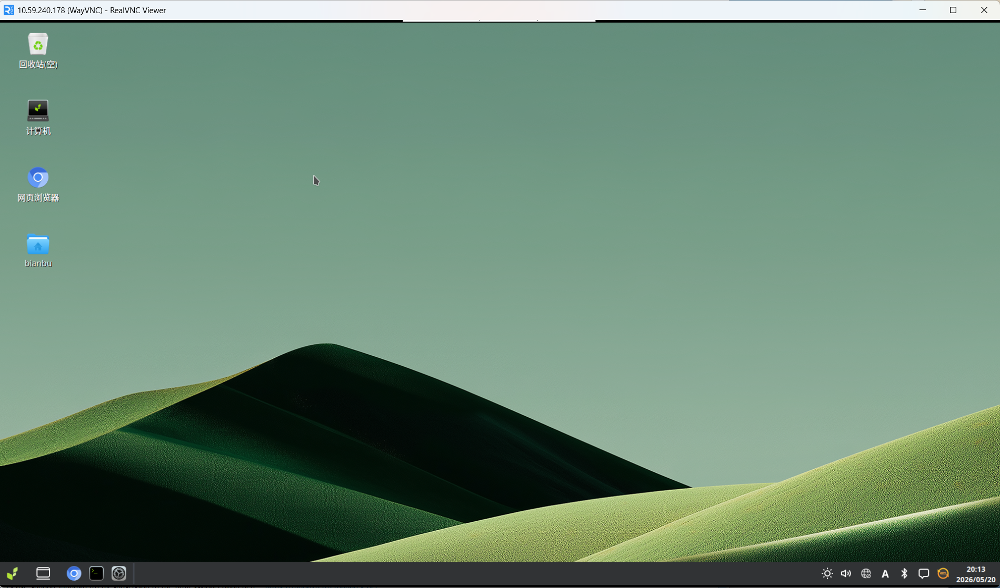

**Option B — TigerVNC:**

1. Launch TigerVNC.
2. Enter the board's IP address (e.g., `10.59.240.178`) in the VNC server address field.
3. Click **Connect**.


The remote desktop will load and display the board's desktop environment.


