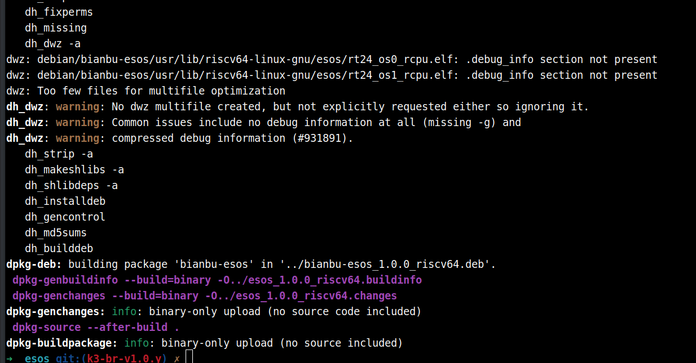
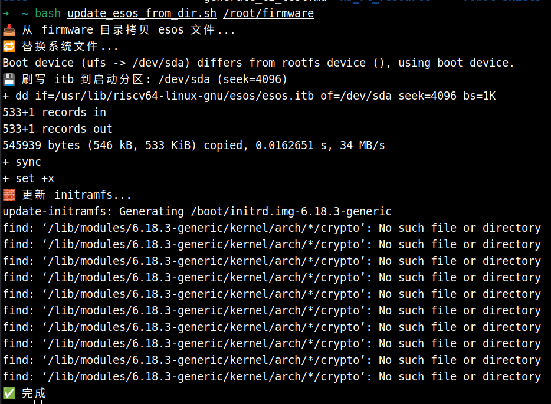
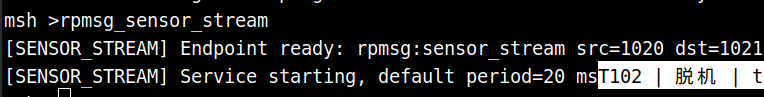
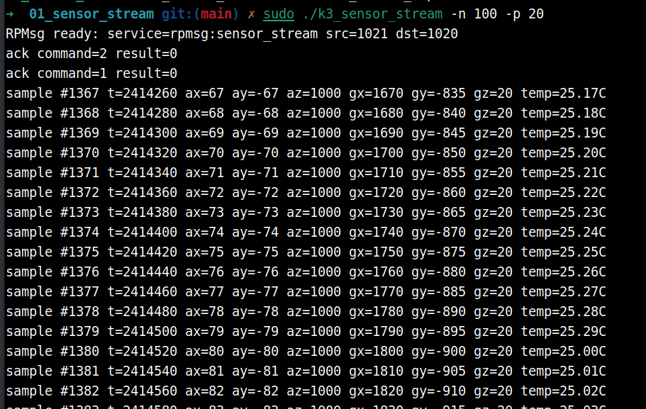
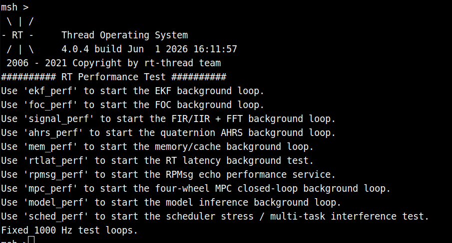
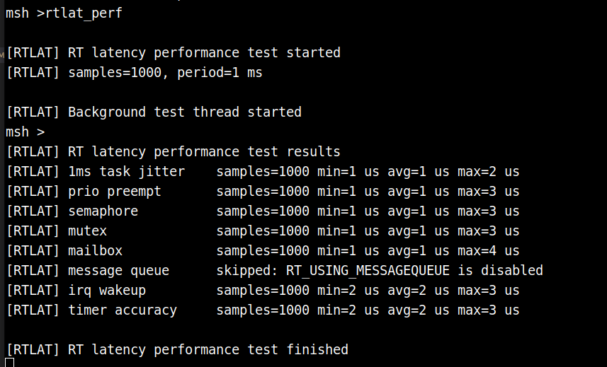

# ESOS 开发指南

esos系统基于rt-thread开发，跑在rcpu上，其功能包含如下两部分

1. 配合大核完成能效管理，如调频调压、power-switch开关、系统reboot、系统休眠唤醒
2. 配合大核完成实时任务处理，如控制电机转动、控制继电器开关等


## 软硬件要求

- K3 Com260 开发板
- K3 Bianbu4.0 及以上版本操作系统


## esos tag 与系统版本对应

|     TAG      | Bianbu 版本 |
| :----------: | :---------: |
| k3-br-v1.0.0 |    4.0.0    |
| k3-br-v1.0.2 |    4.0.1    |

下面的示例使用的是 Bianbu 4.0.0 的系统，因此选用 k3-br-v1.0.0 tag，请注意该对应关系，否则可能导致系统无法启动！

## RCPU调试串口连接


## 编译方式说明

esos 固件可以通过以下两种方式编译：

1. **在 K3 开发板上直接编译**：所有代码下载、依赖安装、构建和 deb 包安装都在 K3 开发板上完成。该方式环境简单，不需要额外准备交叉编译工具链，适合快速验证和小规模修改，但编译速度相对较慢。
2. **在 PC 上交叉编译**：在 X86 Ubuntu 22.04 主机上下载源码并使用交叉编译工具链完成构建，再将生成的 `esos.itb`、`rt24_os0_rcpu.elf`、`rt24_os1_rcpu.elf` 拷贝到 K3 开发板上替换小核固件。该方式编译速度更快，适合日常开发和频繁调试。

如果只是简单验证源码修改，可以选择在 K3 上直接编译；如果需要进行应用开发、频繁修改代码或集成自定义工程，建议使用交叉编译方式。


## 在K3上直接编译

所有操作都在 K3 开发板上完成

### esos代码下载

```
cd ~
git clone https://github.com/spacemit-com/esos.git
cd ~/esos
git checkout k3-br-v1.0.0
```

```
cd ~/esos/components
git clone https://github.com/spacemit-com/esos-lite.git
cd ~/esos/components/esos-lite
git checkout k3-br-v1.0.0
```

### 目录结构说明

esos 是基于 RT-Thread 的系统源码目录，顶层目录结构说明如下：

|     目录/文件      | 说明                                                         |
| :----------------: | :----------------------------------------------------------- |
|        bsp         | 板级支持包目录，包含不同芯片、开发板和平台的移植代码、启动配置、外设驱动适配及工程配置。 |
|     components     | RT-Thread 组件目录，包含文件系统、驱动框架、FinSH、网络协议栈、C/C++ 支持、轻量组件等上层功能模块。 |
|      include       | RT-Thread 内核及公共接口头文件目录，对外提供内核对象、设备框架、系统服务等 API 声明。 |
|       libcpu       | CPU 架构相关移植代码目录，包含 ARM、RISC-V、MIPS、x86 等不同处理器架构的上下文切换、中断、启动等底层实现。 |
|        src         | RT-Thread 内核源码目录，包含线程调度、IPC、定时器、内存管理、对象管理等核心实现。 |
|       tools        | 构建和辅助工具脚本目录，主要用于 SCons 构建、工程生成、配置处理及开发辅助功能。 |
|   documentation    | 项目文档目录，包含编码规范、路线图、Doxygen 配置及相关说明文档。 |
|      examples      | 示例代码目录，提供 RT-Thread 内核、组件或平台功能的使用示例。 |
|       debian       | Debian 打包相关目录，包含软件包控制文件、安装脚本、变更记录和打包规则。 |
|      .github       | GitHub 平台相关配置目录，通常包含 CI、Issue 模板、Pull Request 模板等。 |
|       .gitee       | Gitee 平台相关配置目录。                                     |
|     README.md      | 英文项目说明文档，介绍 RT-Thread 架构、特性、目录结构和使用资源。 |
|    README_zh.md    | 中文项目说明文档，介绍 RT-Thread 架构、特性、代码目录和开发资源。 |
|      Kconfig       | 顶层 Kconfig 配置入口，用于系统裁剪和功能配置。              |
|      build.sh      | 项目构建脚本。                                               |
|    build_top.sh    | 顶层构建辅助脚本。                                           |
|    Jenkinsfile     | Jenkins 持续集成流水线配置文件。                             |
|    ChangeLog.md    | 项目变更记录文件。                                           |
|      LICENSE       | 项目许可证文件。                                             |
|      AUTHORS       | 项目作者或贡献者信息文件。                                   |
|   esos_rt24.its    | 镜像打包相关 ITS 配置文件。                                  |
| esos_rt24_sign.its | 带签名镜像打包相关 ITS 配置文件。                            |
|   null.spacemit    | Spacemit 平台相关占位或配置文件。                            |

### 编译安装

```
sudo apt install lzop
```

```
cd ~/esos
sudo apt-get build-dep .
dpkg-buildpackage -uc -us -b
```

打印如下结果表示编译成功



生成的 deb 包在上级目录

**安装 deb 包**

```
cd ~/esos
dpkg -i ../bianbu-esos_1.0.0_riscv64.deb
```

安装完成后重启开发板即可

重启后，RCPU调试串口新增打印：


该打印主程序在：`~/esos/bsp/spacemit/applications/main.c`，可以修改打印的字符串内容验证固件是否替换成功


## 交叉编译

**建议使用 X86 Ubuntu22.04 ，用于esos代码的交叉编译**

### 代码下载（PC上）

```
cd ~
git clone https://github.com/spacemit-com/esos.git
cd ~/esos
git checkout k3-br-v1.0.0
```

```
cd ~/esos/components
git clone https://github.com/spacemit-com/esos-lite.git
cd ~/esos/components/esos-lite
git checkout k3-br-v1.0.0
```


### 编译（PC上）

```
cd ~/esos
```

**配置工具链**

```
./build.sh config
```

先选1，再选0。会下载交叉编译工具链，确保网络可用，等待完成即可

**配置方案**

```
./build_top.sh config
```

选择1

**执行编译**

```
./build_top.sh
```

产物在 `../output/esos` 目录下，其中`rt24_os0_rcpu.elf`、`rt24_os1_rcpu.elf`、`esos.itb` 是我们所需要的

把`rt24_os0_rcpu.elf`、`rt24_os1_rcpu.elf`、`esos.itb`拷贝到 K3 开发板的某目录，例如：

```
cd ~/esos/../output/esos
scp esos.itb rt24_os0_rcpu.elf rt24_os1_rcpu.elf root@10.0.91.102:~/firmware/
```

### 替换小核固件（K3 上）

```
wget https://archive.spacemit.com/ros2/prebuilt/esos_sh/update_esos_from_dir.sh
bash update_esos_from_dir.sh /root/firmware
```

显示完成表示替换成功，如下图，此时重启开发板即可



RCPU调试串口新增打印：


该打印主程序在：`~/esos/bsp/spacemit/applications/main.c`，可以修改打印的字符串内容验证固件是否替换成功


## 程序开发说明

- K3 上有两个 RCPU ，其中 RCPU0 负责配合大核完成能效管理，请勿更改。一般在 RCPU1 上进行编程，完成一些实时任务。
- 代码工程建议放在`~/esos/bsp/spacemit/applications`目录下，编译配置由修改`~/esos/bsp/spacemit/applications/SConscript`脚本实现

**下面以大小核跨核通信示例来展示如何配置和编译自定义工程，使用交叉编译的方式，也可以使用直接编译的方式**

### 下载示例代码

在 PC 上执行

```
cd ~/esos/bsp/spacemit/applications
git clone https://github.com/spacemit-dev/k3-rt-rpmsg-examples.git
```

### 覆盖SConscript

```
cd ~/esos/bsp/spacemit/applications
cp ./k3-rt-rpmsg-examples/SConscript ./SConscript
```

**SConscript内容解析**

```
Import('RTT_ROOT')
Import('rtconfig')
from building import *

cwd = GetCurrentDir()

# 根据当前板级配置选择需要参与编译的应用源码。
# os0_rcpu 使用默认 main.c。
if rtconfig.BOARD == 'os0_rcpu':
	src = [
		'main.c',
	]
	# 将 applications 当前目录加入头文件搜索路径，便于示例源码引用公共头文件。
	CPPPATH = [
		cwd,
	]
elif rtconfig.BOARD == 'os1_rcpu':
	# os1_rcpu 会同时编译传感器流、马达控制、日志上传等多个 rpmsg 示例。
	src = [
		'k3-rt-rpmsg-examples/01_sensor_stream/sensor_stream_rcpu.c',
		'k3-rt-rpmsg-examples/02_motor_control/motor_control_rcpu.c',
		'k3-rt-rpmsg-examples/03_log_upload/log_upload_rcpu.c',
		'k3-rt-rpmsg-examples/main.c',
	]
	CPPPATH = [
		cwd,
	]
else:
	# 默认路径保持通用行为：自动收集当前目录的所有 C 源文件。
	src = Glob('*.c')
	CPPPATH = [
		cwd,
	]

# -ffunction-sections 让每个函数进入独立 section，便于链接阶段按需裁剪未使用代码。
CCFLAGS = ' -c -ffunction-sections'

# 定义 Applications 构建组，供上层 SCons 构建系统统一收集和链接。
group = DefineGroup('Applications', src, depend = [''], CPPPATH = CPPPATH, CCFLAGS = CCFLAGS)

Return('group')
```

rcpu0 使用默认的main.c，只是保证其编译通过即可，不加其他功能。rcpu1 则指向了编译定制化程序。在执行编译命令时，会先分别编译出 rcpu0、rcpu1的二进制程序以及不同开发板的设备树dtb，最终打包为 esos.itb。


### 执行交叉编译

```
cd ~/esos
./build_top.sh
```

正常的打印如下：


编译完成后，参考：交叉编译小节-替换小核固件（K3 上），完成小核固件替换

替换完成后重启开发板，小核串口打印：


### 编译大核侧通信程序

该步骤在 K3 上执行

```
git clone https://github.com/spacemit-dev/k3-rt-rpmsg-examples.git
```

```
cd ~/k3-rt-rpmsg-examples/01_sensor_stream
gcc -Wall -Wextra -O2 -o k3_sensor_stream k3_sensor_stream.c
```


### 执行示例

以 rpmsg_sensor_stream 为例，其他示例使用方法可以参考 k3-rt-rpmsg-examples 下的 README

**先在小核终端启动服务，执行 `rpmsg_sensor_stream`**



**大核侧执行：**

```
cd ~/k3-rt-rpmsg-examples/01_sensor_stream
sudo ./k3_sensor_stream -n 100 -p 20
```

`-n <count>`：接收样本/日志数量（传感器、日志示例），`-p <ms>`：小核上报周期（传感器、日志示例）

终端打印：




## 示例一. 性能测试套件编译和使用

使用交叉编译方式

### 下载示例代码

在 PC 上执行

```
cd ~/esos/bsp/spacemit/applications
git clone https://github.com/spacemit-dev/rt-perf-test.git
```

### 覆盖SConscript

```
cd ~/esos/bsp/spacemit/applications
cp ./rt-perf-test/SConscript ./SConscript
```

### 修改配置文件

`~/esos/bsp/spacemit/platform/rt24/os1_rcpu/rt24_os1_rcpu_defconfig`

```
CONFIG_RT_TICK_PER_SECOND=100 修改为 1000
```


### 编译和替换

按照交叉编译章节的编译、替换小核固件流程操作即可

替换成功后，小核串口打印：



### 执行测试

例如执行 rtlat_perf

可以得到：




## ESOS更多资源

参考：https://www.spacemit.com/community/document/info?lang=zh&nodepath=software/SDK/buildroot/k3_buildroot/esos
