sidebar_position: 5

# 远程桌面操作指南

## X86 Ubuntu 24.04

## 接口连接

上位机通过USB转TTL设备与MUSE Pi Pro开发板的GND、TX、RX接口连接。示意图如下：

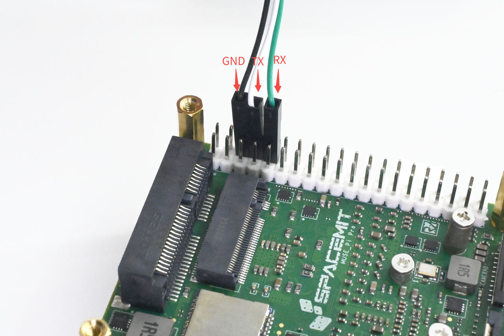

打开Ubuntu电脑终端，输入指令查看当前串口设备：

```
ls /dev/ttyUSB* 2>/dev/null || ls /dev/ttyACM*
```


假设设备识别为 /dev/ttyUSB0

安装 minicom

```
sudo apt update
sudo apt install minicom
```

使用minicom工具进行连接

```
sudo minicom -D /dev/ttyUSB0 -b 115200
```


## Ubuntu系统登录操作

按下开发板复位键，待系统加载至如下界面（若系统已初始化，跳过此步骤，进入下一步）。


按下回车键，待系统加载至如下界面。

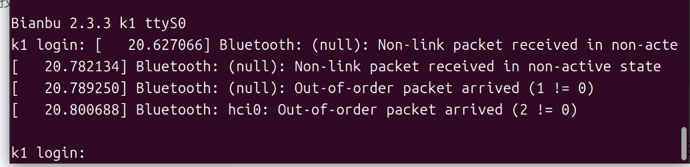

当系统显示上述界面后，在提示符后输入用户名 root，按下回车键；

随后在密码提示处输入密码 bianbu（输入时终端不显示字符），按下回车键；

系统将完成登录并进入开发板。

## 系统未完成过初始化

### 阶段一：连接网络并确定IP地址

\<remote_ip\>:开发板局域网 IP 地址。

#### 场景一：开发板已接入网线

执行：

```
hostname -I
```

显示\<remote_ip\>:


#### 场景二：开发板未连接网线，需通过 Wi‑Fi 接入网络

执行：

```
ifconfig
```

以下图为例，请记录框选的网卡接口名称（例如:wlan0），下方指令需使用（**注意**：实际内容可能并非是wlan0）

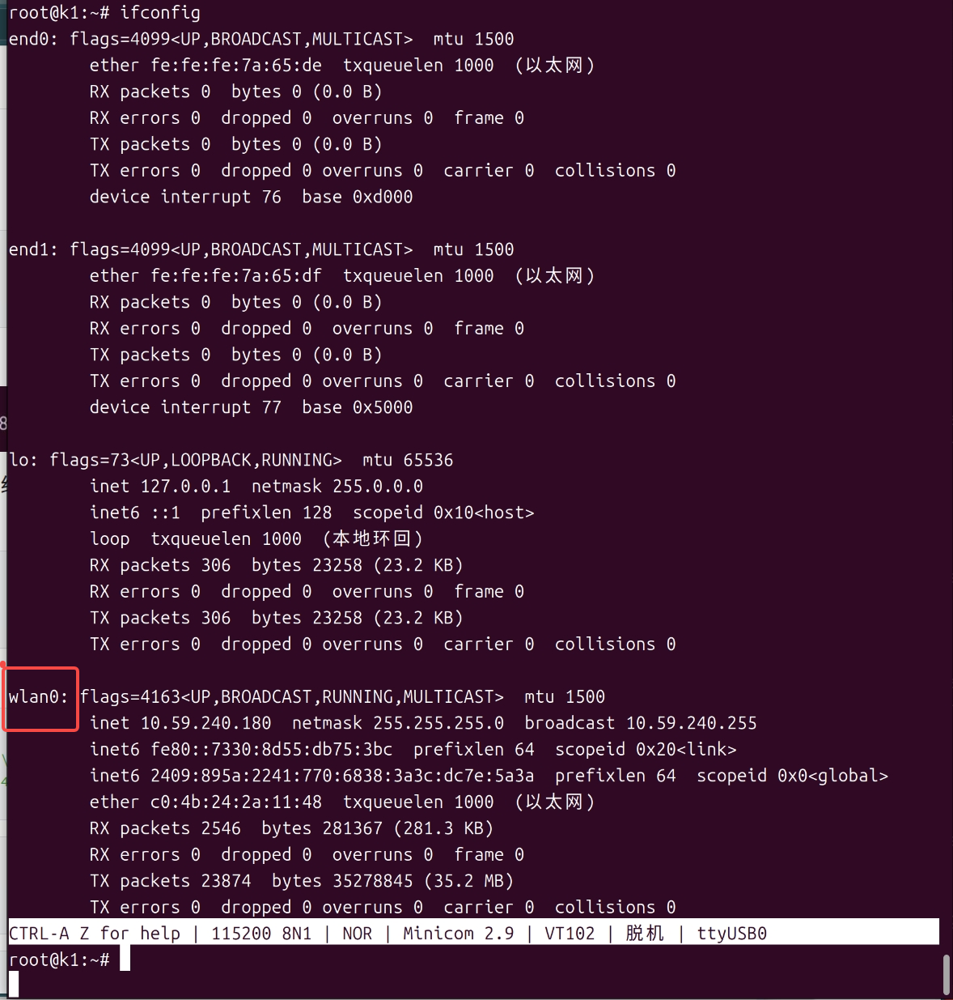

执行下方指令（**注意**：将所有wlan0替换为实际网卡名称）：

```
wpa_cli -i wlan0 add_network
```

（**注意**：替换下方内容为实际 WiFi 信息 ）

```
wpa_cli -i wlan0 set_network 0 ssid "\"WiFi名称\""
wpa_cli -i wlan0 set_network 0 psk "\"WiFi密码\""
```

```
wpa_cli -i wlan0 enable_network 0
```

```
/szin/dhcpcd wlan0
```

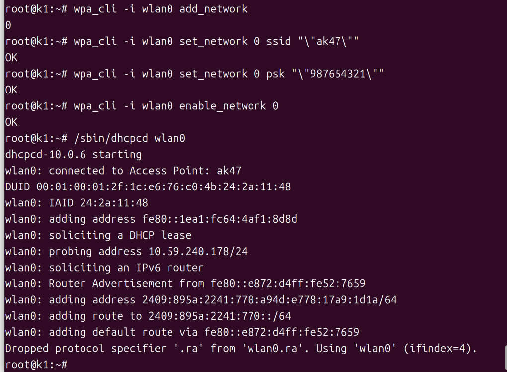

执行：

```
hostname -I
```

显示\<remote_ip\>:

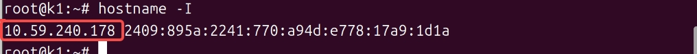

### 阶段二： 通过WayVNC 远程桌面连接进行初始化

执行：

```
cat > /etc/sddm.conf <<'EOF'
[Theme]
Current=bianbu-theme
  
[General]
DisplayServer=wayland
GreeterEnvironment=QT_WAYLAND_SHELL_INTEGRATION=xdg-shell,WLR_LIBINPUT_NO_DEVICES=1
  
[Wayland]
CompositorCommand=labwc
SessionDir=/usr/share/calamares/wayland-sessions/
  
[Autologin]
User=initer
Session=bianbu-init
Relogin=false
EOF
```

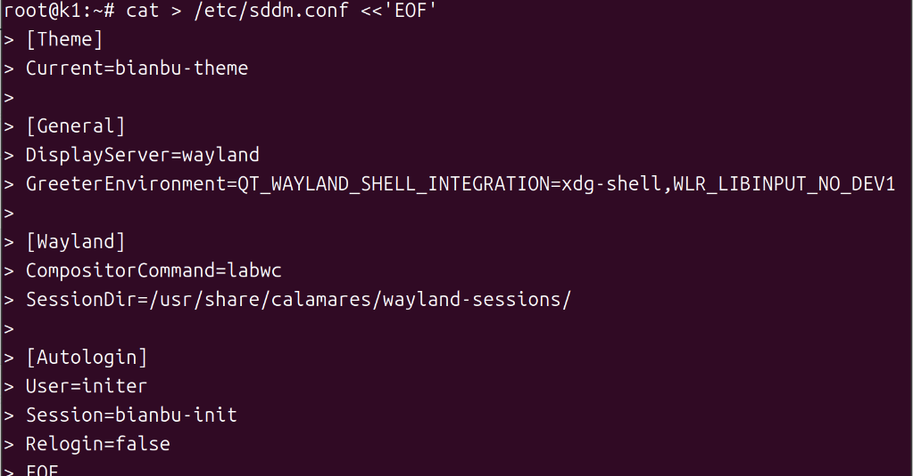

备份环境配置脚本

```
cp /usr/libexec/start-bianbu-init-env /usr/libexec/start-bianbu-init-env.bak_final
```

设置环境变量

```
sed -i '/export QT_QPA_PLATFORM=wayland/a\export LABWC_FALLBACK_OUTPUT=NOOP-fallback\nexport LABWC_VIRTUAL_OUTPUT_SIZE=1920x1080' /usr/libexec/start-bianbu-init-env
```

执行：

```
ps aux | grep labwc | grep -v grep
```

获取进程号。（框住位置即为实际进程号位置，具体数值以自己显示为准）

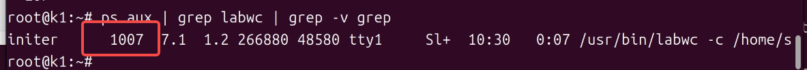

执行 kill 加上查到的进程号即可

```
kill 实际进程号
```

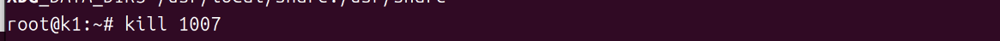

执行：

```
systemctl restart sddm
```


等待5秒后，执行：

```
AUTO_UID=$(id -u initer)
```

```
export XDG_RUNTIME_DIR="/run/user/$AUTO_UID"
```

```
export WAYLAND_DISPLAY=$(basename /run/user/$AUTO_UID/wayland-*)
```

```
export QT_QPA_PLATFORM=wayland
export QT_WAYLAND_SHELL_INTEGRATION=xdg-shell
```

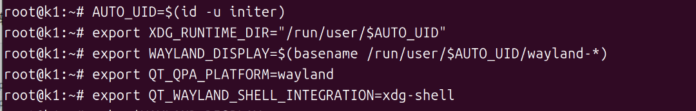

启动 wayvnc

```
XDG_RUNTIME_DIR="$XDG_RUNTIME_DIR" WAYLAND_DISPLAY="$WAYLAND_DISPLAY" wayvnc 0.0.0.0 5900
```

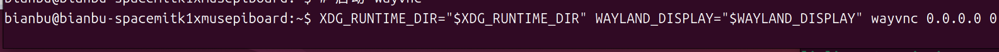

**注意**：使用任何 VNC
客户端连接开发板，上位机与开发板必须处于同一局域网（例如连接到同一个Wi-Fi 或路由器）

开启Ubuntu电脑新的终端

推荐使用  **Remmina** 客户端，配置方式如下：

1）安装 Remmina

```
sudo apt update
sudo apt install remmina remmina-plugin-rdp remmina-plugin-vnc remmina-plugin-secret
```


2）启动 Remmina

```
remmina
```


3）在连接配置中：

协议选择  VNC；

地址输入 \<remote_ip\>:5900；

按下回车进行连接。

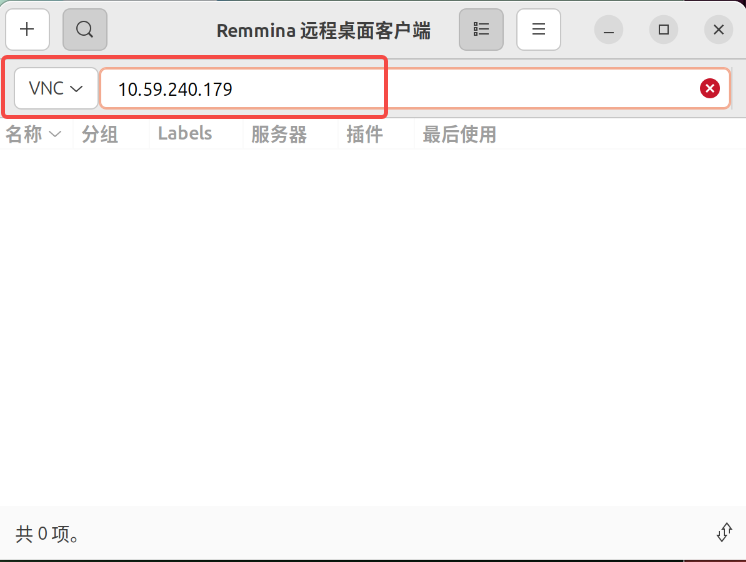

进入bianbu系统初始化界面。


进行用户信息配置时，请妥善保管您的账户，建议将账号和密码均设置为
bianbu，以便后续操作。配置完毕后，系统即进入初始化阶段，需等待约 10 秒。

## 系统已完成过初始化

### 阶段一：连接网络并切换账户

按照 "**Ubuntu系统登录操作**"进行登录

#### 连接网络

若以太网已连接：继续向下执行后续的初始化步骤。

若以太网未连接：系统将识别为离线环境，请转入 "**系统未初始化 阶段一**"
中的'**场景二**'处理流程。处理结束后，继续执行后续步骤。

执行用户切换操作，切换为普通用户；示例账号为bianbu，实际需替换为前期自行创建的账号名。

```
su - 实际创建的普通用户名
```

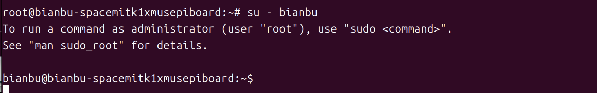

### 阶段二：通过 WayVNC 远程桌面连接进入桌面

在个人用户目录中执行以下指令：

```
TARGET_USER=$(awk -F: '$3>=1000 && $3<65534 {print $1}' /etc/passwd | head -n1)

sudo tee /etc/sddm.conf > /dev/null <<EOF
[Theme]
Current=bianbu-star

[General]
DisplayServer=wayland
GreeterEnvironment=QT_WAYLAND_SHELL_INTEGRATION=xdg-shell,WLR_LIBINPUT_NO_DEVICES=1
[Wayland]
CompositorCommand=labwc

[Autologin]
User=$TARGET_USER
Session=bianbu-lite
Relogin=false
EOF

 ```

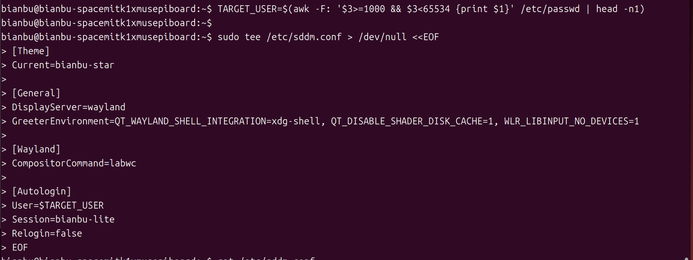

输入当前用户密码


备份环境配置脚本

```
sudo cp /usr/bin/startlxqtwayland /usr/bin/startlxqtwayland.clean
```

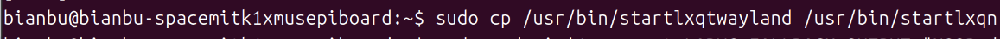

设置环境变量

```
sudo sed -i '1a export LABWC_FALLBACK_OUTPUT="NOOP-fallback"\nexport LABWC_VIRTUAL_OUTPUT_SIZE="1920x1080"' /usr/bin/startlxqtwayland
```


执行：

```
systemctl restart sddm
```

输入密码


等待 5 秒后，执行：

```
WAYLAND_SOCKET=$(find /run/user -path "/run/user/0/*" -prune -o -name "wayland-*" -type s -print 2>/dev/null | head -n1)
XDG_RUNTIME_DIR=$(dirname "$WAYLAND_SOCKET")
WAYLAND_DISPLAY=$(basename "$WAYLAND_SOCKET")
```

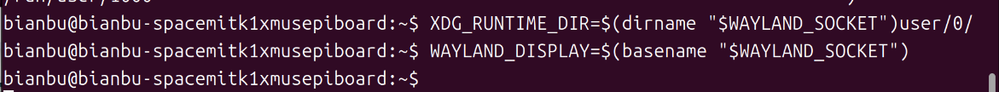

启动 wayvnc

```
XDG_RUNTIME_DIR="$XDG_RUNTIME_DIR" WAYLAND_DISPLAY="$WAYLAND_DISPLAY" wayvnc 0.0.0.0 5900
```


**注意**：使用任何 VNC
客户端连接开发板，上位机与开发板必须处于同一局域网（例如连接到同一个Wi-Fi 或路由器）

开启Ubuntu电脑新的终端

推荐使用  **Remmina** 客户端：

1）启动 Remmina

```
remmina
```


2）在连接配置中：

协议选择  VNC；

地址输入 \<remote_ip\>:5900；

按下回车进行连接。


进入桌面。


## Windows 11

下载 **MobaXterm** 串口调试工具，官方参考链接：

<https://mobaxterm.mobatek.net/>

下载**RealVNC**客户端或者**TigerVNC**客户端

## 接口连接

上位机通过USB转TTL设备与MUSE Pi
Pro开发板的GND、TX、RX接口连接。示意图如下：


以  MobaXterm 工具为例：

1）正确连接串口，并在 **设备管理器** 中确认识别到对应的 COM
端口，如下图所示：


2）打开 **MobaXterm**，依次点击 **"Sessions"** → **"New
Session"**，选择连接类型为 **Serial**。

3）在弹出的配置窗口中设置：

**Serial port**：选择识别到的 COM 端口（如 COM7）；

**Speed**：设为 115200；

点击 **OK** 进入串口终端。


（MobaXterm在执行指令时出现行错位、文字重叠属于正常现象）

## Windows系统登录操作

按下开发板复位键触发系统加载流程，待系统加载完毕后，按下回车键，随即呈现如下界面：


当系统显示上述界面后，在提示符后输入用户名
root，按下回车键；随后在密码提示处输入密码
bianbu（输入时终端不显示字符），按下回车键；系统将完成登录并进入开发板。

## 系统未完成过初始化

### 阶段一：连接网络并确定IP地址

#### 场景一：开发板已接入网线

执行：

```
hostname -I
```

显示\<remote_ip\>:


#### 场景二：开发板未连接网线，需通过 Wi‑Fi 接入网络

执行：

```
ifconfig
```

以下图为例，请记录框选的网卡接口名称（例如:wlan0），下方指令需使用（**注意**：实际名称可能并非是 wlan0）


执行下方指令（**注意**：将所有wlan0替换为实际网卡名称）：

```
wpa_cli -i wlan0 add_network
```

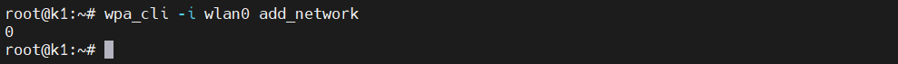

（**注意**：替换下方内容为实际 WiFi 信息 ）

```
wpa_cli -i wlan0 set_network 0 ssid "\"WiFi账号\""
wpa_cli -i wlan0 set_network 0 psk "\"WiFi密码\""
```

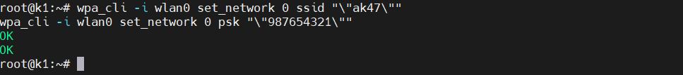

```
wpa_cli -i wlan0 enable_network 0
```


等待5s后执行：

```
/sbin/dhcpcd wlan0
```

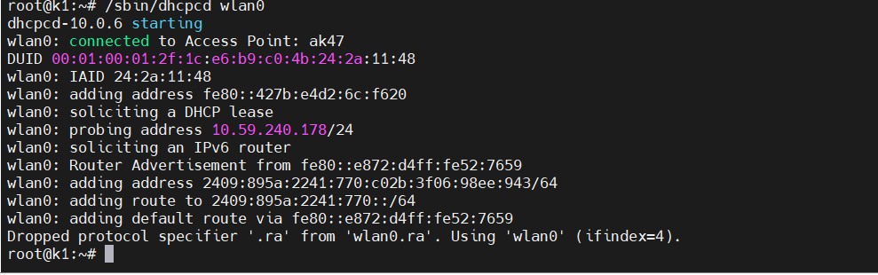

执行：

```
hostname -I
```

显示\<remote_ip\>:


### 阶段二： 通过WayVNC 远程桌面连接进行初始化

执行：

```
cat > /etc/sddm.conf <<'EOF'
[Theme]
Current=bianbu-theme

[General]
DisplayServer=wayland
GreeterEnvironment=QT_WAYLAND_SHELL_INTEGRATION=xdg-shell,WLR_LIBINPUT_NO_DEVICES=1

[Wayland]
CompositorCommand=labwc
SessionDir=/usr/share/calamares/wayland-sessions/

[Autologin]
User=initer
Session=bianbu-init
Relogin=false
EOF
```


备份环境配置脚本

```
cp /usr/libexec/start-bianbu-init-env /usr/libexec/start-bianbu-init-env.bak_final
```

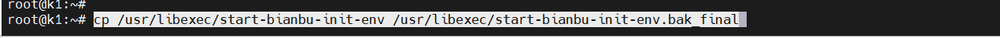

设置环境变量

```
sed -i '/export QT_QPA_PLATFORM=wayland/a\export LABWC_FALLBACK_OUTPUT=NOOP-fallback\nexport LABWC_VIRTUAL_OUTPUT_SIZE=1920x1080' /usr/libexec/start-bianbu-init-env
```


执行：

```
ps aux | grep labwc | grep -v grep
```

获取进程号。（框住位置即为实际进程号位置，具体数值以自己显示为准）


执行 kill 加上查到的进程号即可

```
kill 实际进程号
```

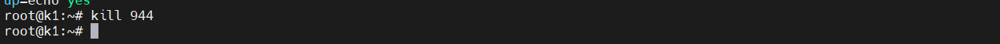

执行

```
systemctl restart sddm
sleep 5
```

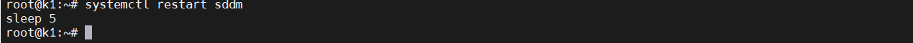

等待 5 秒后，执行：

```
AUTO_UID=$(id -u initer)
```

```
export XDG_RUNTIME_DIR="/run/user/$AUTO_UID"
```

```
exort WAYLAND_DISPLAY=$(basename /run/user/$AUTO_UID/wayland-*)
   ```

```
export QT_QPA_PLATFORM=wayland
```

```
export QT_WAYLAND_SHELL_INTEGRATION=xdg-shell
```


启动 wayvnc

```
XDG_RUNTIME_DIR="$XDG_RUNTIME_DIR" WAYLAND_DISPLAY="$WAYLAND_DISPLAY" wayvnc 0.0.0.0 5900
```

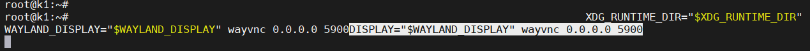

**注意**：使用任何 VNC
客户端连接开发板，上位机与开发板必须处于同一局域网（例如连接到同一个Wi-Fi 或路由器）

推荐使用  **RealVNC Viewer** 客户端：

1）启动 VNC Viewer；

2）在连接地址栏输入：\<remote_ip\>（如 192.168.1.100）；

3）回车即可连接至远程桌面界面。


点击所框内容

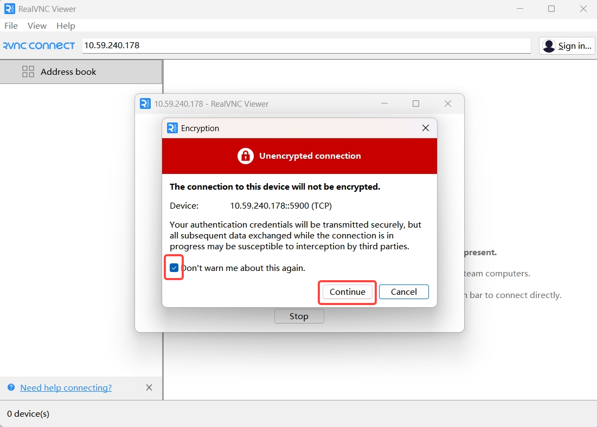

进入bianbu系统初始化界面。


或者使用  **TigerVNC** 客户端：

1）启动 TigerVNC；

2）在VNC服务器地址栏输入：ip（如 10.59.240.178）；

3）点击连接即可连接至远程桌面界面。


进入bianbu系统初始化界面。


进行用户信息配置时，请妥善保管您的账户，建议将账号和密码均设置为
bianbu，以便后续操作。配置完毕后，系统即进入初始化阶段，需等待约 10 秒。

## 系统已完成过初始化

### 阶段一：连接网络并切换账户

按照 "**Windows系统登录操作**" 进行登录。

#### 连接网络

若以太网已连接：继续向下执行后续的初始化步骤。

若以太网未连接：系统将识别为离线环境，请转入 "**系统未初始化 阶段一**"
中的'**场景二**'处理流程。处理结束后，继续执行后续步骤。

执行用户切换操作，切换为普通用户；示例账号为
bianbu，实际需替换为前期自行创建的账号名。

```
su - 实际创建的普通用户名
```


### 阶段二：通过 WayVNC 远程桌面连接进入桌面

在个人用户目录中执行以下指令：

```
TARGET_USER=$(awk -F: '$3>=1000 && $3<65534 {print $1}' /etc/passwd | head -n1)

sudo tee /etc/sddm.conf > /dev/null <<EOF
[Theme]
Current=bianbu-star

[General]
DisplayServer=wayland
GreeterEnvironment=QT_WAYLAND_SHELL_INTEGRATION=xdg-shell,WLR_LIBINPUT_NO_DEVICES=1
[Wayland]
CompositorCommand=labwc

[Autologin]
User=$TARGET_USER
Session=bianbu-lite
Relogin=false
EOF
```

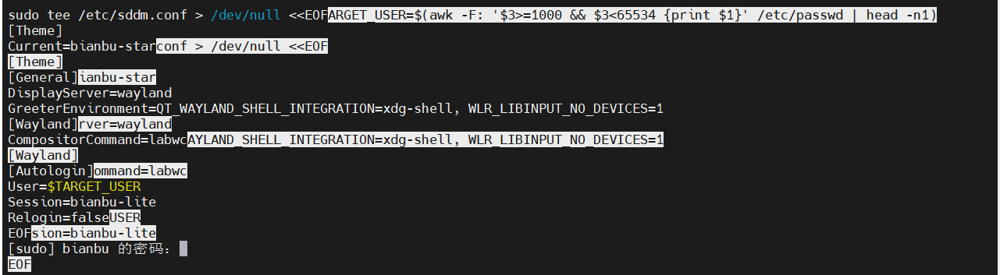

输入密码并按下回车键


备份环境配置脚本

```
sudo cp /usr/bin/startlxqtwayland /usr/bin/startlxqtwayland.clean
```

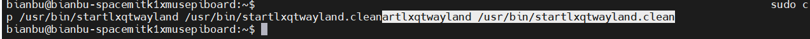

设置环境变量

```
sudo sed -i '1a export LABWC_FALLBACK_OUTPUT="NOOP-fallback"\nexport LABWC_VIRTUAL_OUTPUT_SIZE="1920x1080"' /usr/bin/startlxqtwayland
```

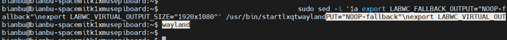

执行

```
systemctl restart sddm
```

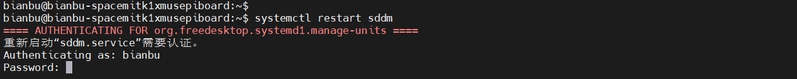

输入密码，按下回车键确认。


执行：

```
WAYLAND_SOCKET=$(find /run/user -path "/run/user/0/*" -prune -o -name "wayland-*" -type s -print 2>/dev/null | head -n1)
```

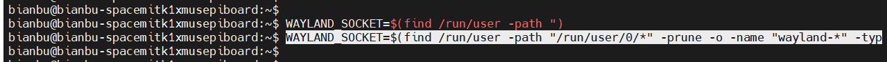

```
XDG_RUNTIME_DIR=$(dirname "$WAYLAND_SOCKET")
```

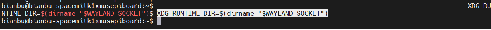

```
WAYLAND_DISPLAY=$(basename "$WAYLAND_SOCKET")
```

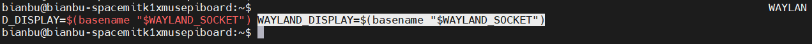

启动 wayvnc

```
XDG_RUNTIME_DIR="$XDG_RUNTIME_DIR" WAYLAND_DISPLAY="$WAYLAND_DISPLAY" wayvnc 0.0.0.0 5900
```

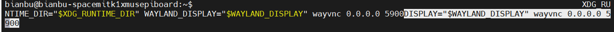

**注意**：使用任何 VNC
客户端连接开发板，上位机与开发板必须处于同一局域网（例如连接到同一个Wi-Fi 或路由器）

推荐使用 **RealVNC Viewer** 客户端：

1）启动 VNC Viewer；

2）在连接地址栏输入：\<remote_ip\>（如 192.168.1.100）；

3）回车即可连接至远程桌面界面。


进入桌面。


或者使用 TigerVNC客户端：

1）启动 TigerVNC；

2）在VNC服务器地址栏输入：ip（如 10.59.240.178）；

3）点击连接即可连接至远程桌面界面。


进入桌面。

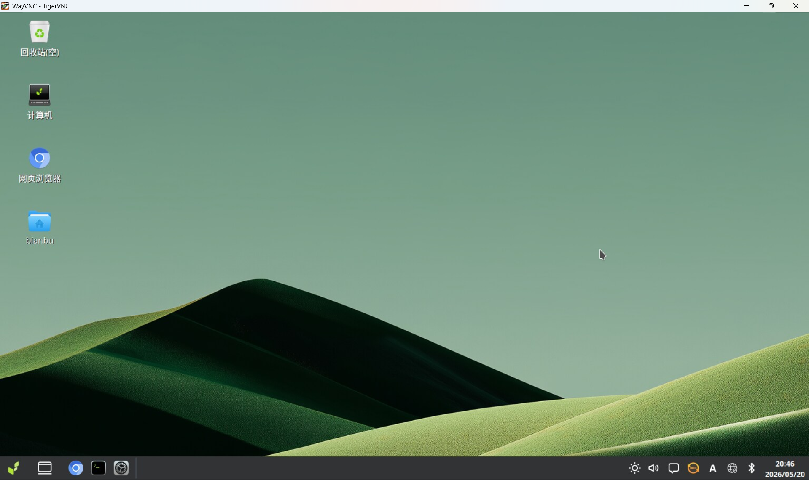
